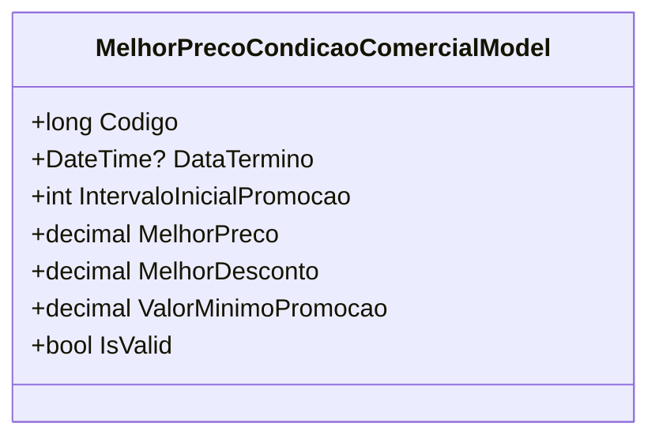

# MelhorPrecoCondicaoComercialModel
**Namespace**: IsthmusWinthor.Dominio.POCO.Precos.IsthmusIndustrias.CondicoesComerciais  
**Nome do Arquivo**: MelhorPrecoCondicaoComercialModel.cs  

## Visão Geral e Responsabilidade
A classe `MelhorPrecoCondicaoComercialModel` representa uma condição comercial especializada que calcula o melhor preço com base em um desconto aplicado sobre o preço original para um cliente específico. O objetivo principal desta classe é permitir que o sistema determine se o cliente está recebendo a melhor condição de preço possível, levando em conta descontos e promoções, assegurando que as ofertas sejam válidas e vantajosas.

## Métodos de Negócio
### Título: IsValid (Propriedade Pública)
- **Objetivo**: Assegurar que a condição comercial somente seja válida se houver um desconto aplicado.
- **Comportamento**: Retorna um valor booleano que indica se o `MelhorDesconto` é maior que zero. Caso seja maior, a condição é considerada válida; caso contrário, é inválida.
- **Retorno**: Retorna `true` se houver um desconto eficaz (> 0), e `false` caso contrário.

## Propriedades Calculadas e de Validação
### MelhorPreco
- **Cálculo**: A propriedade `MelhorPreco` é calculada subtraindo o valor do desconto aplicado ao `precoCliente`. A lógica do cálculo se dá da seguinte maneira: 

    \[
    \text{MelhorPreco} = \text{precoCliente} - \left( \frac{\text{melhorDesconto} \times \text{precoCliente}}{100} \right)
    \]

Esta propriedade garante que o preço final apresentado ao cliente seja adequado ao desconto dado.

## Navigations Property
- ***Nenhuma propriedade de navegação complexa é identificada nesta classe.***

## Tipos Auxiliares e Dependências
- **Enums e Classes Utilizadas**: Nenhum enumerador ou classe auxiliar é utilizado diretamente nesta classe além dos tipos básicos do .NET.

## Diagrama de Relacionamentos

Este documento apresenta a estrutura e as regras de negócio associadas ao modelo `MelhorPrecoCondicaoComercialModel`, facilitando a compreensão de seu papel na aplicação e a integridade dos dados que representa.
---
Gerada em 29/12/2025 21:58:11
