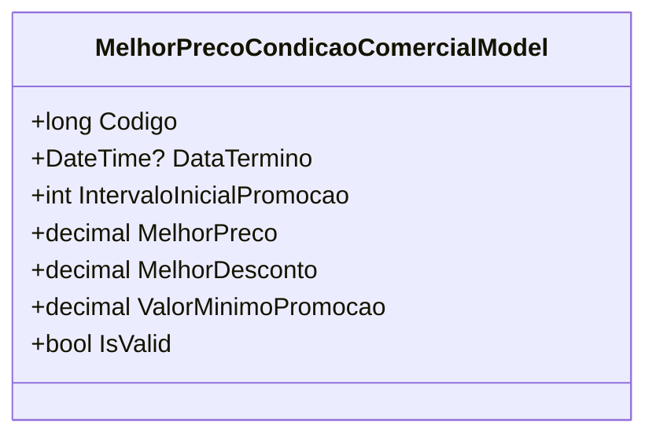

# MelhorPrecoCondicaoComercialModel
**Namespace**: IsthmusWinthor.Dominio.POCO.Precos.IsthmusIndustrias.CondicoesComerciais  
**Nome do Arquivo**: MelhorPrecoCondicaoComercialModel.cs  

## Visão Geral e Responsabilidade
A classe `MelhorPrecoCondicaoComercialModel` atua como um modelo de condição comercial que encapsula a lógica de cálculo do melhor preço para um cliente, considerando um desconto aplicável. O problema de negócio que ela resolve é a necessidade de calcular automaticamente o preço mais vantajoso a ser oferecido, levando em conta a promoção e os parâmetros de desconto, além de validar se o desconto é válido.

## Métodos de Negócio

### `IsValid` (Propriedade Pública)
- **Objetivo**: Verificar se o desconto aplicado é maior que zero, garantindo que somente condições comerciais válidas sejam consideradas.
- **Comportamento**: 
    1. Verifica se `MelhorDesconto` é maior que zero.
    2. Retorna `true` se a condição for satisfeita, caso contrário, retorna `false`.
- **Retorno**: 
    - `true` se o desconto é válido.
    - `false` se o desconto é inválido.

## Propriedades Calculadas e de Validação
- `MelhorPreco`: Calcula o preço com o desconto aplicado! A regra para o cálculo é a seguinte:
  - `MelhorPreco` é calculado como `precoCliente - ((melhorDesconto * precoCliente) / 100)`, onde:
    - `precoCliente`: o preço original antes do desconto.
    - `melhorDesconto`: proporção de desconto a ser aplicada.
  
## Navigation Property
Não há propriedades de navegação complexas nesta classe.

## Tipos Auxiliares e Dependências
Não há enumeradores ou classes estáticas utilizadas neste modelo.

## Diagrama de Relacionamentos
Neste caso, não há relações com outras classes ou enums a serem representadas, uma vez que a classe é autônoma e não possui interações definidas.

