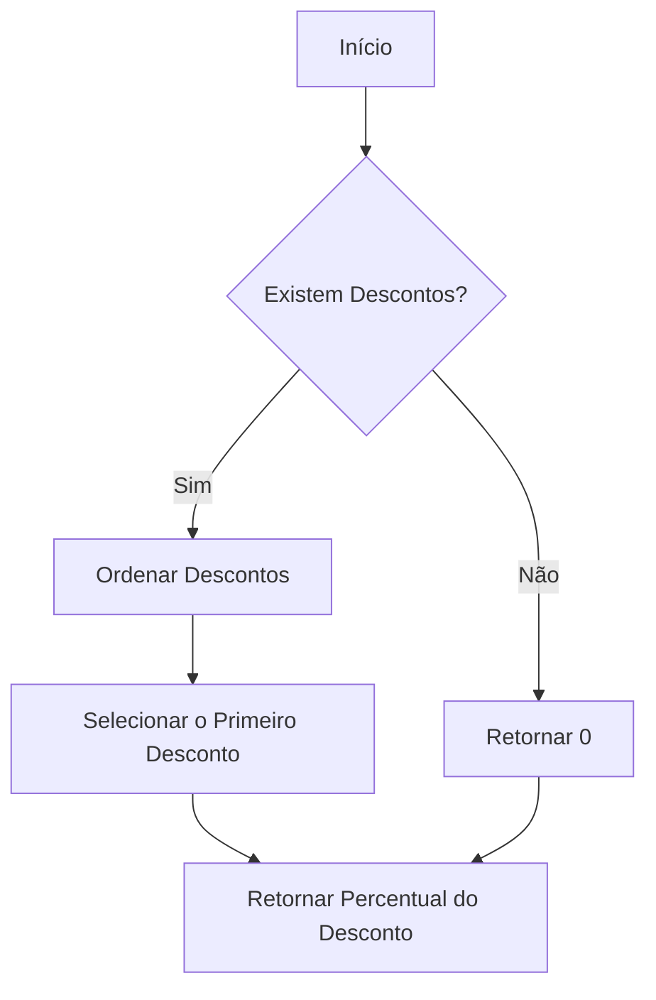
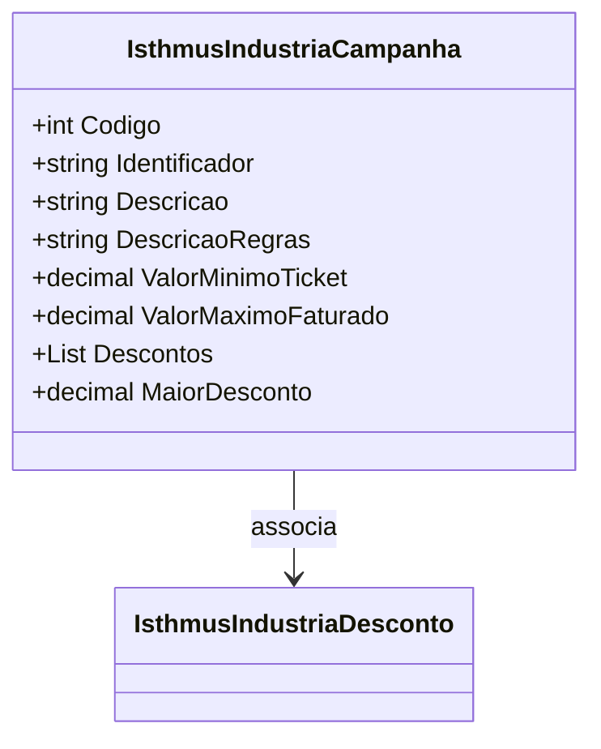

# IsthmusIndustriaCampanha
**Namespace**: IsthmusWinthor.Dominio.POCO.Precos.IsthmusIndustrias  
**Nome do Arquivo**: IsthmusIndustriaCampanha.cs  

## Visão Geral e Responsabilidade
A classe `IsthmusIndustriaCampanha` representa uma campanha promocional industrial que encapsula as regras e condições sob as quais descontos podem ser aplicados a produtos ou serviços. O problema de negócio que ela resolve é a necessidade de gerenciar e calcular os descontos aplicáveis nos tickets de vendas, garantindo que os descontos oferecidos sejam sempre os mais vantajosos para a empresa, respeitando o valor mínimo de ticket e o máximo faturado.

## Métodos de Negócio

### Título: MaiorDesconto (Acessível)
- **Objetivo**: Garantir que a aplicação da lógica de desconto retorne o maior percentual de desconto disponível nas campanhas.
- **Comportamento**: 
  1. A lista de descontos (`Descontos`) é ordenada em ordem decrescente de percentual de desconto (`PercentualDesconto`).
  2. O primeiro desconto da lista ordenada é selecionado.
  3. Se houver descontos na lista, o percentual do desconto é retornado; caso contrário, 0 é retornado.
- **Retorno**: Retorna o maior percentual de desconto encontrado na lista de descontos ou 0 se não houver descontos.

## Propriedades Calculadas e de Validação

### Propriedades
- **MaiorDesconto**: Retorna o maior percentual de desconto entre os disponíveis. A regra é que essa propriedade deve assegurar que o percentual mais alto seja retornado, priorizando a lógica de seleção e ordenação dos descontos.

## Navigations Property
- [IsthmusIndustriaDesconto](IsthmusIndustriaDesconto.md): Representa os objetos de desconto que estão associados a esta campanha.

## Tipos Auxiliares e Dependências
- [IsthmusIndustriaDesconto](IsthmusIndustriaDesconto.md): Classe utilizada para representar o desconto aplicado dentro da campanha.

## Diagrama de Relacionamentos

---
Gerada em 29/12/2025 21:57:09
