# IsthmusIndustriaCampanha
- **Namespace**: IsthmusWinthor.Dominio.POCO.Precos.IsthmusIndustrias
- **Nome do Arquivo**: IsthmusIndustriaCampanha.cs

## Visão Geral e Responsabilidade
A classe `IsthmusIndustriaCampanha` representa uma campanha de preços para indústrias, sendo um componente fundamental no gerenciamento de promoções e descontos. Seu papel é centralizar as regras e condições que definem como os descontos devem ser aplicados, considerando valores mínimos e máximos envolvidos na operação. A classe é responsável por garantir a integridade dos dados ao validar e calcular os descontos aplicáveis a partir de uma lista associada de descontos (`Descontos`).

## Métodos de Negócio

### MaiorDesconto: Propriedade Calculada
- **Objetivo**: Determinar o maior percentual de desconto disponível na campanha.
- **Comportamento**: A propriedade acessa a coleção de descontos e ordena os itens de forma decrescente com base no percentual de desconto. Em seguida, retorna o valor do desconto mais alto ou zero se não houver descontos cadastrados.
- **Retorno**: Retorna o maior percentual de desconto encontrado na lista ou zero se não houver descontos.

```mermaid
flowchart TD
    A[Início] --> B{Existem Descontos?}
    B -- Sim --> C[Ordena Descontos]
    C --> D{Tem Desconto?}
    D -- Sim --> E[Retorna Maior Percentual de Desconto]
    D -- Não --> F[Retorna 0]
    B -- Não --> F
```

## Propriedades Calculadas e de Validação
- **MaiorDesconto**: Calcula e retorna o maior percentual de desconto entre os descontos associados à campanha.

## Navigations Property
- **Descontos**: Representa uma coleção de descontos associados à campanha. A classe relacionada é `[IsthmusIndustriaDesconto](IsthmusIndustriaDesconto.md)`.

## Tipos Auxiliares e Dependências
- Classe Relacionada: `[IsthmusIndustriaDesconto](IsthmusIndustriaDesconto.md)`

## Diagrama de Relacionamentos

Esta documentação técnica proporciona uma visão clara e concisa sobre a classe `IsthmusIndustriaCampanha`, abordando suas responsabilidades de negócio, definindo claramente as regras de cálculo e as interações com outras classes do domínio.
