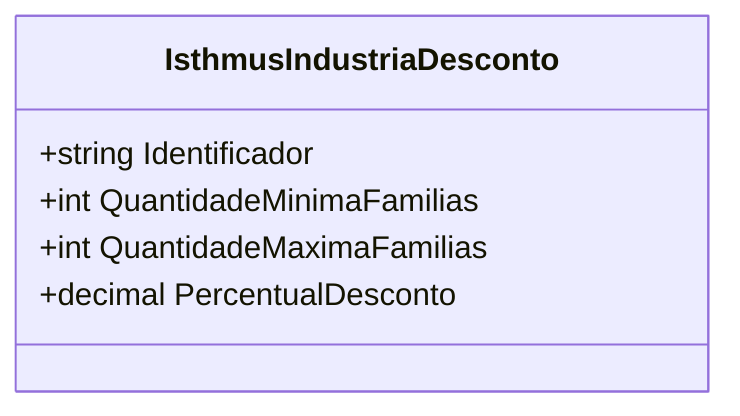

# IsthmusIndustriaDesconto
- **Namespace**: IsthmusWinthor.Dominio.POCO.Precos.IsthmusIndustrias
- **Nome do Arquivo**: IsthmusIndustriaDesconto.cs

## Visão Geral e Responsabilidade
A classe `IsthmusIndustriaDesconto` representa um modelo de desconto aplicado a produtos em uma indústria específica. Sua principal responsabilidade é definir as condições em que descontos podem ser concedidos, de acordo com a quantidade de famílias adquiridas. Esta estrutura é fundamental para a implementação de estratégias de preços que incentivam compras em maior volume.

## Propriedades Calculadas e de Validação
- **QuantidadeMinimaFamilias**: Define o número mínimo de famílias que precisam ser compradas para que o desconto seja aplicado.
- **QuantidadeMaximaFamilias**: Define o número máximo de famílias que podem ser compradas e ainda se qualificarem para o desconto.
- **PercentualDesconto**: Indica o percentual de desconto a ser aplicado com base nas quantidades de famílias compradas, de acordo com as propriedades acima.

## Tipos Auxiliares e Dependências
Não há enums ou classes auxiliares referenciadas dentro da classe `IsthmusIndustriaDesconto`.

## Diagrama de Relacionamentos

Esta documentação fornece uma análise detalhada da classe `IsthmusIndustriaDesconto`, destacando suas responsabilidades e características com foco nas regras de negócio que promove.
---
Gerada em 29/12/2025 21:57:17
