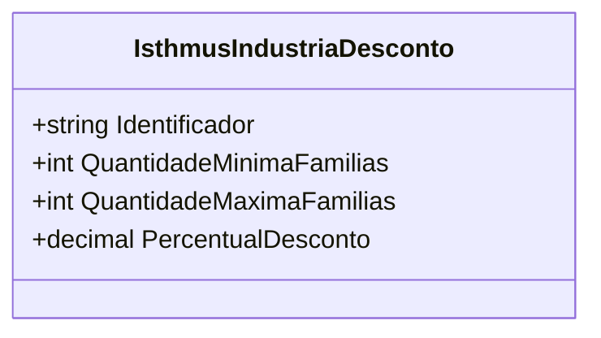

# IsthmusIndustriaDesconto
**Namespace**: IsthmusWinthor.Dominio.POCO.Precos.IsthmusIndustrias  
**Nome do Arquivo**: IsthmusIndustriaDesconto.cs  

A classe `IsthmusIndustriaDesconto` é um Data Transfer Object (DTO) que transporta informações relacionadas a descontos aplicáveis a indústrias. Ela contém propriedades que definem os critérios e valores para a aplicação de um desconto.

## Métodos de Negócio
N/A

## Propriedades Calculadas e de Validação
N/A

## Navigations Property
N/A

## Tipos Auxiliares e Dependências
N/A

## Diagrama de Relacionamentos

