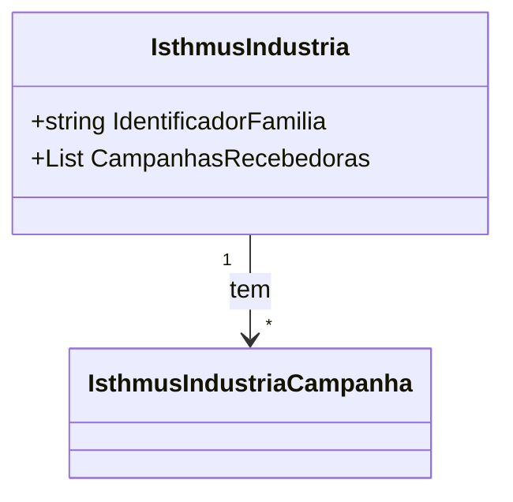

# IsthmusIndustria
**Namespace**: IsthmusWinthor.Dominio.POCO.Precos.IsthmusIndustrias  
**Nome do Arquivo**: IsthmusIndustria.cs  

## Visão Geral e Responsabilidade
A classe `IsthmusIndustria` representa uma entidade no domínio que agrega informações sobre indústrias dentro do sistema. O papel principal dessa classe é organizar e gerenciar campanhas associadas a uma indústria específica, encapsulando a lógica de associação entre a indústria e suas campanhas. O problema de negócio que ela resolve é a necessidade de manter um controle estruturado das campanhas que estão ativas ou relacionadas a uma indústria, permitindo que as campanhas sejam gerenciadas de forma eficiente.

## Métodos de Negócio
### Título: Construtor (public IsthmusIndustria)
- **Objetivo**: Inicializa a lista de campanhas recebedoras quando uma nova instância de `IsthmusIndustria` é criada.
- **Comportamento**:
  1. Ao criar instâncias da classe, o construtor é chamado.
  2. A propriedade `CampanhasRecebedoras` é inicializada como uma nova lista, garantindo que não ocorra erro ao tentar adicionar campanhas antes que a lista seja criada.
- **Retorno**: Não retorna valor, mas garante que a lista de campanhas está pronta para uso.

## Propriedades Calculadas e de Validação
- **IdentificadorFamilia**: 
  - Esta propriedade armazena um identificador único para a família da indústria. Não há lógica de validação ou cálculo complexa associada a ela, apenas recebe um valor string.
  
## Navigation Properties
- **CampanhasRecebedoras**: 
  - Lista de campanhas associadas à indústria. Cada item na lista é da classe [IsthmusIndustriaCampanha](IsthmusIndustriaCampanha.md).

## Tipos Auxiliares e Dependências
- **IsthmusIndustriaCampanha**
  - Esta classe representa campanhas e está diretamente associada às indústrias. Relaciona-se na lógica de negócio da classe `IsthmusIndustria`.

## Diagrama de Relacionamentos

---
Gerada em 29/12/2025 21:57:27
