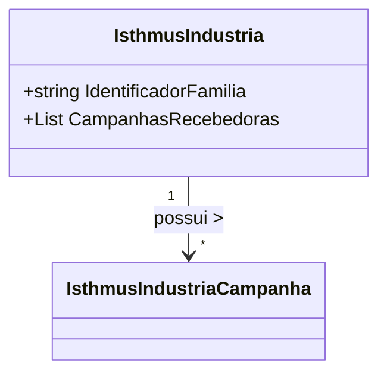

# IsthmusIndustria
**Namespace**: IsthmusWinthor.Dominio.POCO.Precos.IsthmusIndustrias  
**Nome do Arquivo**: IsthmusIndustria.cs  

## Visão Geral e Responsabilidade
A classe `IsthmusIndustria` representa uma entidade de domínio que encapsula conceitos relacionados a indústrias, especialmente no que se refere à identificação de uma família de produtos e suas campanhas associadas. Ela é responsável por gerenciar a lista de campanhas que podem receber informações ou ações necessárias, permitindo que as operações de marketing e vendas sejam direcionadas com eficiência.

## Métodos de Negócio
### Criação de campanhas
- **Título**: AdicionarCampanha (public)
- **Objetivo**: Garante que uma nova campanha seja associada a uma indústria.
- **Comportamento**: 
  1. Verifica se a campanha a ser adicionada não é nula.
  2. Adiciona a campanha à lista `CampanhasRecebedoras`.
- **Retorno**: Não possui retorno; altera o estado interno da lista de campanhas em `CampanhasRecebedoras`.

### Remover campanha
- **Título**: RemoverCampanha (public)
- **Objetivo**: Garante que uma campanha possa ser removida da lista, mantendo a integridade da campanha associada à indústria.
- **Comportamento**:
  1. Verifica se a campanha existe na lista `CampanhasRecebedoras`.
  2. Remove a campanha se encontrada.
- **Retorno**: Não possui retorno; altera o estado interno da lista de campanhas em `CampanhasRecebedoras`.

## Propriedades Calculadas e de Validação
- Não há propriedades calculadas ou de validação apresentadas nesta classe.

## Navigation Property
- `CampanhasRecebedoras`: Lista de campanhas associadas ao objeto `IsthmusIndustria`.
  - [IsthmusIndustriaCampanha](IsthmusIndustriaCampanha.md)

## Tipos Auxiliares e Dependências
- Não há enumeradores ou classes estáticas referenciadas nesta classe.

## Diagrama de Relacionamentos

