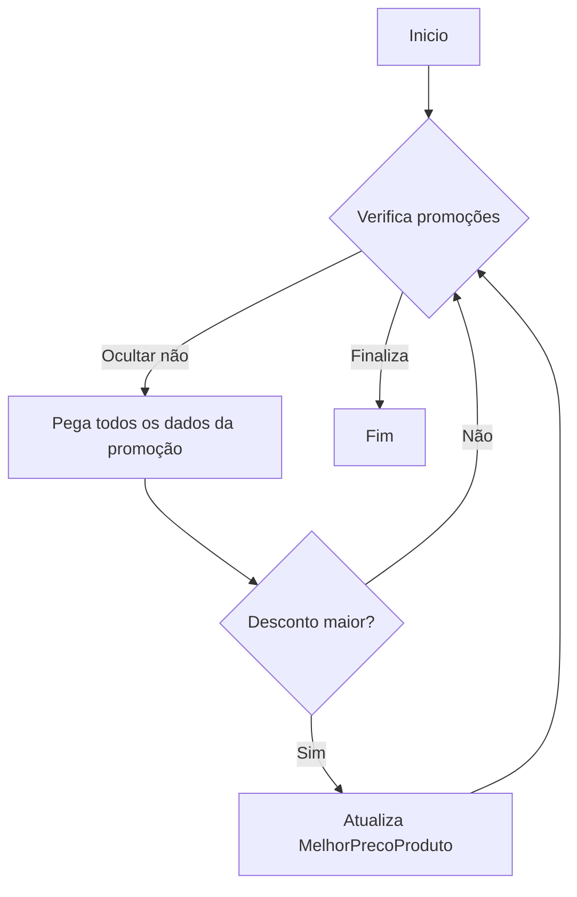
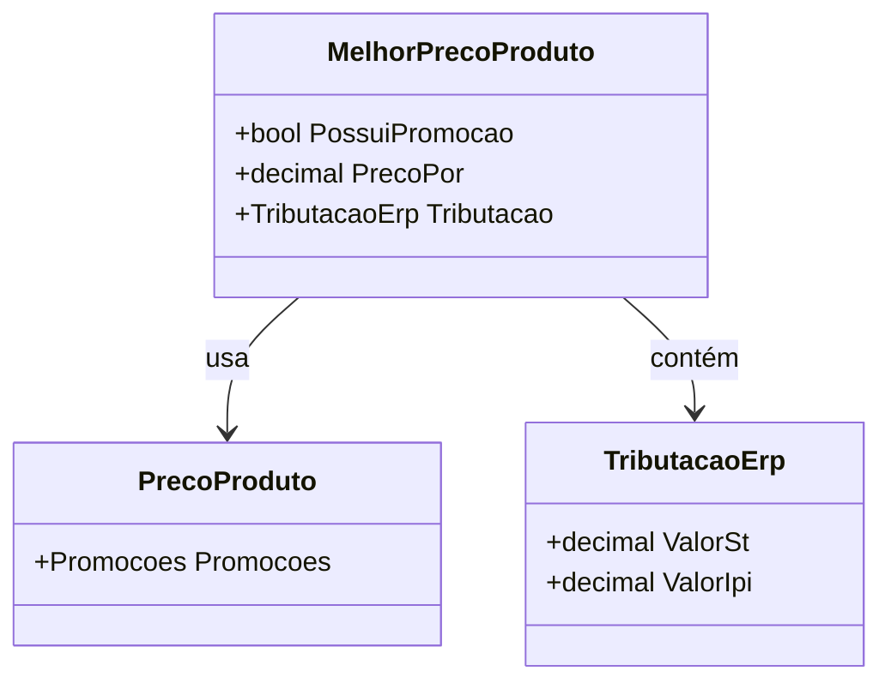

# MelhorPrecoProduto
**Namespace**: IsthmusWinthor.Dominio.EntidadesCosmos.Precos  
**Nome do Arquivo**: MelhorPrecoProduto.cs  

## Visão Geral e Responsabilidade
A classe `MelhorPrecoProduto` é responsável por calcular e armazenar as melhores ofertas de preços para produtos, considerando promoções e condições comerciais. Seu papel é fornecer ao sistema a melhor opção de preço, levando em conta variáveis como descontos, obrigações fiscais e condições específicas de comercialização, que podem impactar significativamente a decisão de compra do consumidor.

## Métodos de Negócio

### VarrerPromocoes
* **Visibilidade**: private  
* **Objetivo**: Identificar a promoção com o maior percentual de desconto disponível para um produto.  
* **Comportamento**:  
  1. Itera por todas as promoções disponíveis no objeto `PrecoProduto`.
  2. Para cada promoção:
     - Verifica se a promoção não está oculta.
     - Compara o percentual de desconto da promoção atual com o percentual armazenado na instância.
     - Se o percentual da promoção atual for maior, atualiza as propriedades do objeto `MelhorPrecoProduto` com as informações da promoção identificada.
  3. A lógica inclui diferentes tipos de promoções, como faixas de quantidade, combos, e promoções que alteram o preço da tabela.
* **Retorno**: Este método não retorna um valor; ele modifica o estado interno do objeto.

### ParaBaseCalculoFlex
* **Visibilidade**: public  
* **Objetivo**: Converter a instância atual em um formato adequado para calcular preços flexíveis.  
* **Comportamento**: Cria uma nova instância de `BaseCalculoFlexDTO` preenchendo-a com os dados relevantes, como percentual de desconto e informações sobre política de preços.
* **Retorno**: Retorna uma instância de `BaseCalculoFlexDTO` com informações pertinentes ao cálculo de flexibilidade de preços.

## Propriedades Calculadas e de Validação

### ValorSt
- **Regra**: Retorna o valor de Substituição Tributária se disponível, caso contrário retorna 0. 

### PrecoPorSemSt
- **Regra**: Calcula o preço atual do produto subtraindo o valor de ST do preço promocional.

### DescricaoDescontoPromocao
- **Regra**: Retorna uma string formatada com o percentual de desconto, dependendo se a promoção foi atingida ou não.

### DescricaoDescontoFinanceiro
- **Regra**: Retorna uma string formatada com o percentual de desconto financeiro apenas se superior a 1.

### DescricaoCondicaoPromocao
- **Regra**: Gera uma descrição das condições aplicáveis à promoção, variando conforme o valor mínimo da promoção e a quantidade inicial.

## Navigations Property
- [TributacaoErp](TributacaoErp.md)

## Tipos Auxiliares e Dependências
- [TipoPromocaoEnum](TipoPromocaoEnum.md)
- [PrecoProduto](PrecoProduto.md)
- [BaseCalculoFlexDTO](BaseCalculoFlexDTO.md)

## Diagrama de Relacionamentos

---
Gerada em 29/12/2025 21:50:57
