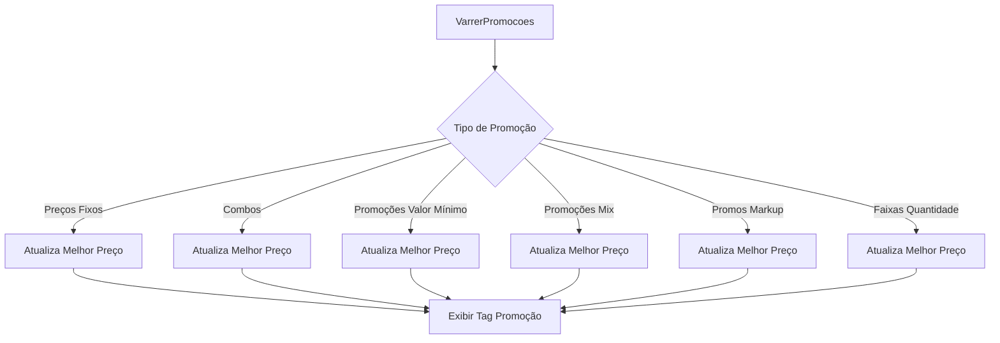
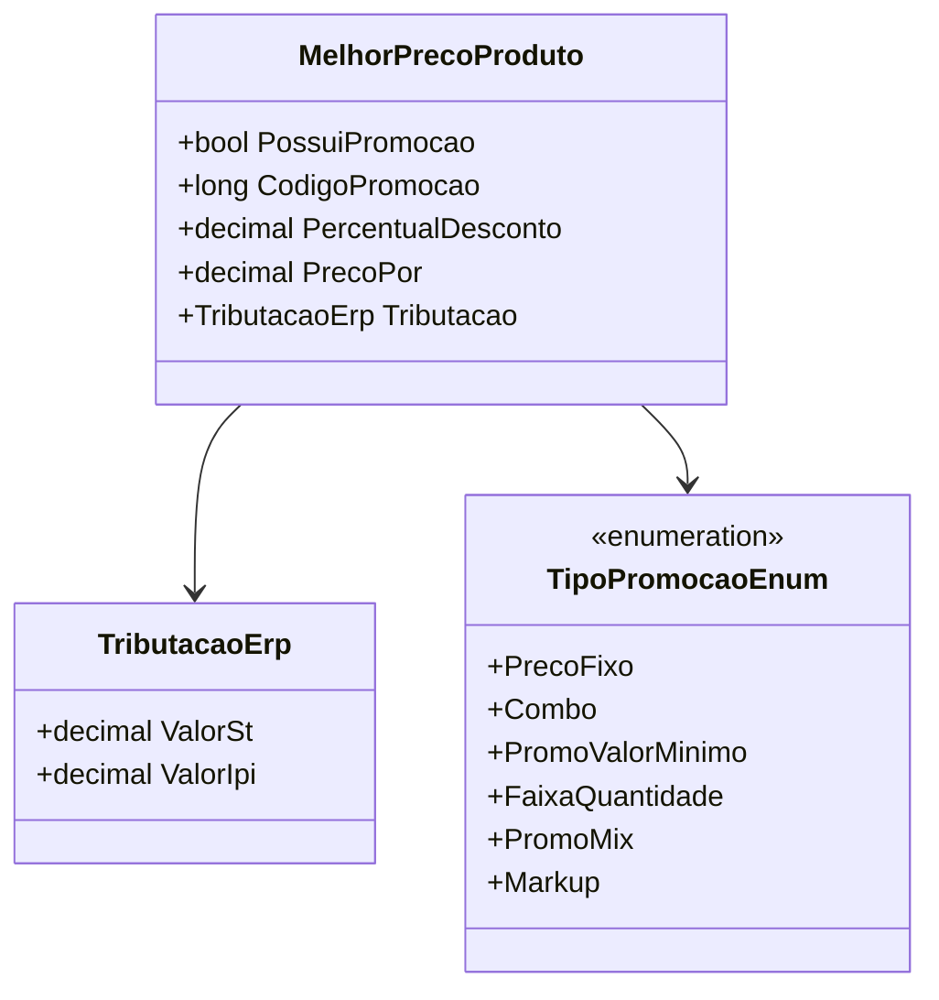

```markdown
# MelhorPrecoProduto
- **Namespace**: IsthmusWinthor.Dominio.EntidadesCosmos.Precos
- **Nome do Arquivo**: MelhorPrecoProduto.cs

## Visão Geral e Responsabilidade
A classe `MelhorPrecoProduto` é responsável por calcular e representar o melhor preço possível para um produto, considerando suas promoções e condições comerciais. Ela busca resolver o problema de como apresentar a melhor oferta ao cliente levando em conta diversas regras de negócio, como descontos disponíveis e condições promocionais.

## Métodos de Negócio

### Método: `VarrerPromocoes` (private)
- **Objetivo**: Este método tem a intenção de verificar todas as promoções associadas a um `PrecoProduto` e determinar a promoção com o maior percentual de desconto, a qual será definida como o "melhor preço possível".
- **Comportamento**: 
    1. O método itera por diferentes tipos de promoções (Preços Fixos, Combos, Promoções de Valor Mínimo, etc.).
    2. Para cada promoção, ele verifica se não deve ser ocultada e se o percentual de desconto da promoção é maior que o atual.
    3. Se uma nova promoção válida é encontrada, os atributos do objeto `MelhorPrecoProduto` são atualizados com os dados dessa nova promoção.
- **Retorno**: Este método não retorna valor, mas altera o estado interno do objeto com os melhores dados de promoção encontrados.



### Método: `ParaBaseCalculoFlex` 
- **Objetivo**: Este método converte o estado do objeto `MelhorPrecoProduto` em um DTO que pode ser utilizado para cálculos flexíveis.
- **Comportamento**: Retorna uma instância de `BaseCalculoFlexDTO` preenchida com os dados relevantes do objeto atual, como percentual de desconto e informações relacionadas à política de preços.
- **Retorno**: `BaseCalculoFlexDTO` representando a configuração atual do melhor preço para fins de cálculo.

## Propriedades Calculadas e de Validação

### Propriedades com lógica:
- `ValorSt`: Retorna o valor de ST (Substituição Tributária) do objeto `Tributacao` se estiver presente; caso contrário, retorna 0.
- `PrecoPorSemSt`: Retorna o preço atual descontando o valor de ST.
- `DescricaoDescontoPromocao`: Gera uma descrição do desconto promocional baseado no percentual de desconto e se a promoção foi atingida.
- `DescricaoDescontoFinanceiro`: Gera uma descrição do desconto financeiro baseado no percentual de desconto financeiro.
- `DescricaoCondicaoPromocao`: Gera uma descrição das condições promocionais com base nas regras de avaliação implementadas.

## Navigations Property
- `[TributacaoErp](TributacaoErp.md)`

## Tipos Auxiliares e Dependências
- `[TipoPromocaoEnum](TipoPromocaoEnum.md)`
- `[BaseCalculoFlexDTO](BaseCalculoFlexDTO.md)`

## Diagrama de Relacionamentos

```
