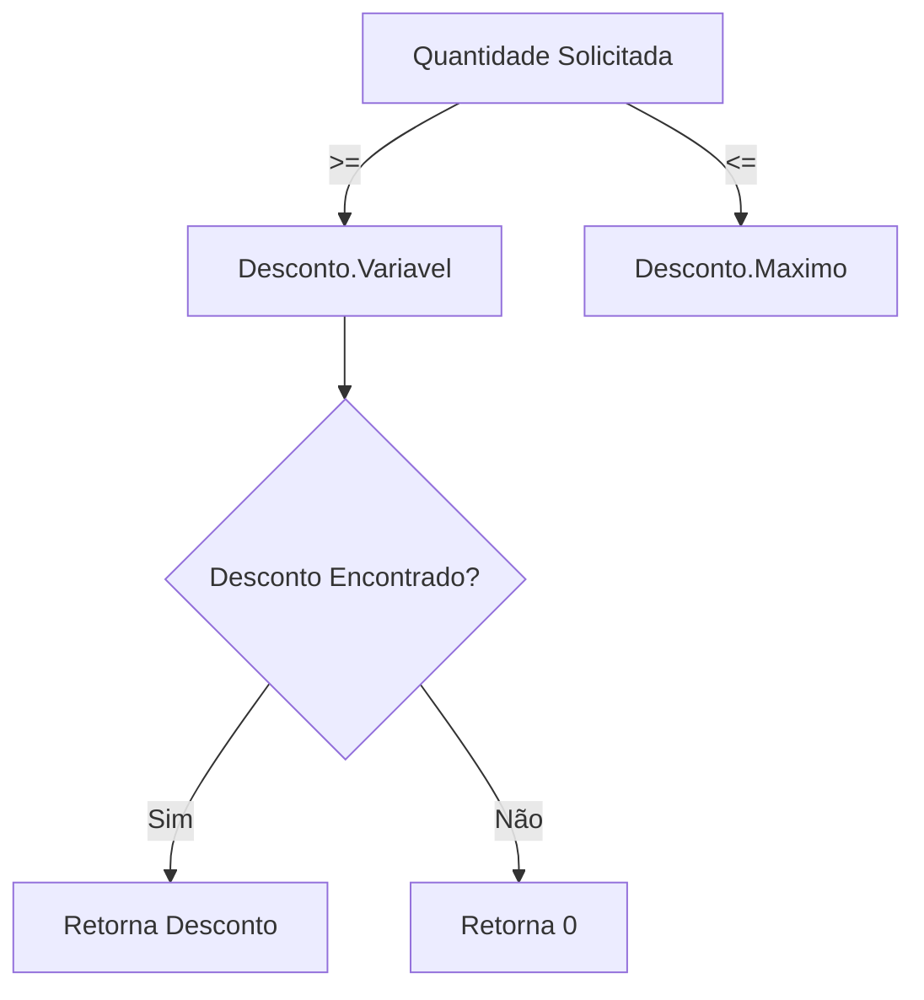
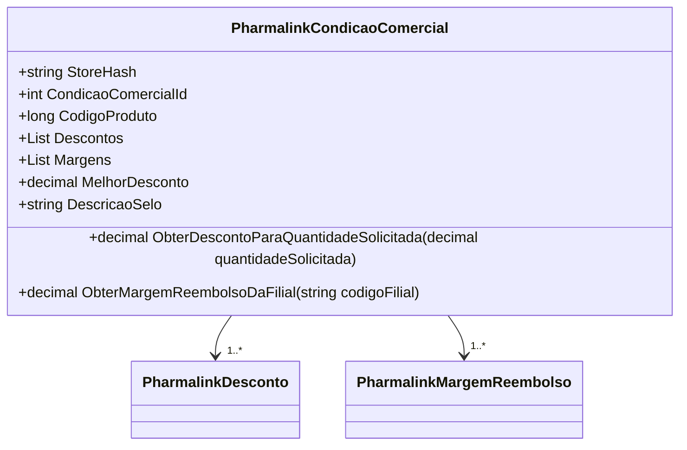

# PharmalinkCondicaoComercial
- **Namespace**: IsthmusWinthor.Dominio.POCO.Precos
- **Nome do Arquivo**: PharmalinkCondicaoComercial.cs

## Visão Geral e Responsabilidade
A classe `PharmalinkCondicaoComercial` representa uma condição comercial específica para produtos dentro de uma loja, incluindo informações sobre descontos e margens de reembolso. Seu papel principal é fornecer uma maneira de calcular o melhor desconto disponível para uma determinada quantidade de produto e a margem de reembolso aplicável a uma filial específica. Ela agrega dados de desconto e margem de reembolso, permitindo otimizar a oferta comercial e garantir que as condições corretas sejam aplicadas às vendas.

## Métodos de Negócio

### ObterDescontoParaQuantidadeSolicitada
- **Título**: `ObterDescontoParaQuantidadeSolicitada` (public)
- **Objetivo**: Este método garante que seja aplicado o desconto correto com base na quantidade solicitada de produtos.
- **Comportamento**: 
  1. Ordena a lista de `Descontos` pela quantidade.
  2. Filtra os descontos que são aplicáveis (a quantidade solicitada deve estar dentro dos limites de quantidade definida por cada desconto).
  3. Retorna o desconto correspondente ou 0 se não houver um desconto aplicável.
- **Retorno**: Retorna um decimal representando o valor do desconto ou 0 caso não haja desconto aplicável.

### ObterMargemReembolsoDaFilial
- **Título**: `ObterMargemReembolsoDaFilial` (public)
- **Objetivo**: Garante que a margem de reembolso correta seja recuperada com base no código da filial.
- **Comportamento**: 
  1. Verifica se o `codigoFilial` não está vazio ou nulo.
  2. Filtra as margens de reembolso que correspondem ao `codigoFilial` e ordena por margem em ordem decrescente.
  3. Retorna a margem de reembolso maior ou 0 se não houver margem correspondente.
- **Retorno**: Retorna um decimal representando a margem de reembolso ou 0 caso não haja nenhuma associada à filial.

## Propriedades Calculadas e de Validação

### IsValid
- Esta propriedade avalia se existe pelo menos um desconto válido na lista de `Descontos`. A regra aqui é que a condição comercial deve ser considerada válida se pelo menos um desconto estiver ativo, permitindo assim a aplicação de promoções.

### MelhorDesconto
- Calcula o melhor desconto disponível ao encontrar o desconto que tenha o maior valor entre os válidos. Se não houver descontos válidos, retornará 0.

### DescricaoSelo
- Retorna uma string formatada representando o melhor desconto de forma percentual, com o formato específico de "X.XX% Off". Se não houver desconto, retorna uma string vazia.

## Navigations Property
- [PharmalinkDesconto](PharmalinkDesconto.md)
- [PharmalinkMargemReembolso](PharmalinkMargemReembolso.md)

## Tipos Auxiliares e Dependências
- **Enumeradores**: Não existem enumeradores nas propriedades/interfaces da classe.
- **Classes Estáticas/Helpers**: Não existem classes estáticas ou helpers utilizados diretamente aqui.

## Diagrama de Relacionamentos

---
Gerada em 29/12/2025 21:51:16
