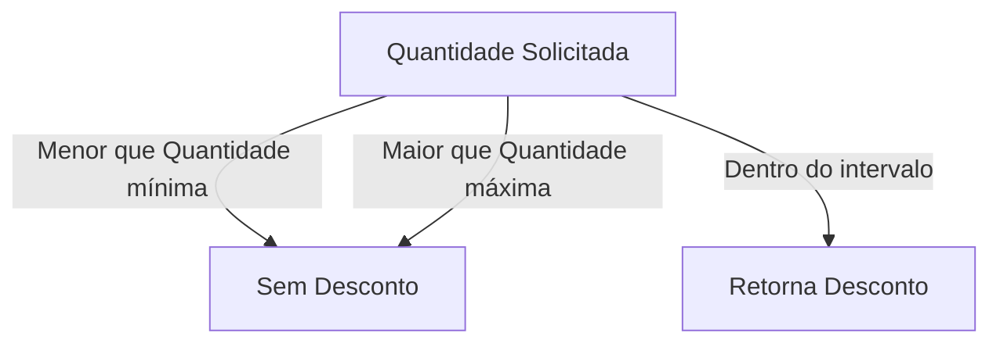
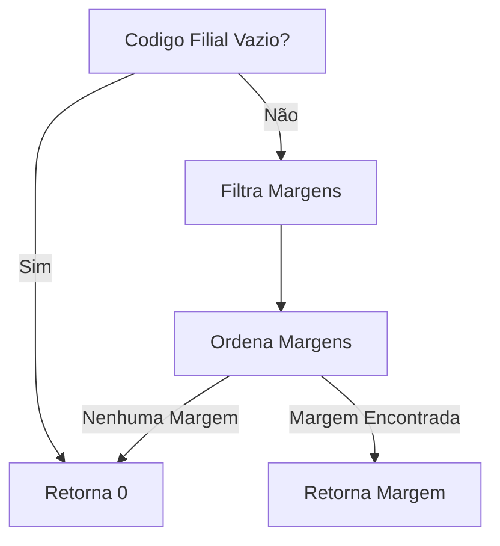
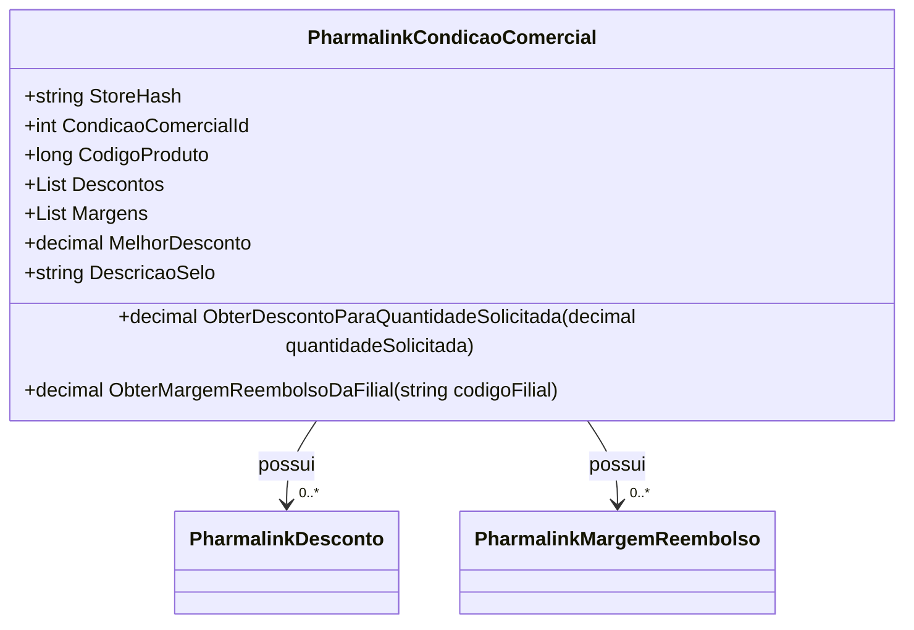

# PharmalinkCondicaoComercial
**Namespace**: IsthmusWinthor.Dominio.POCO.Precos  
**Nome do Arquivo**: PharmalinkCondicaoComercial.cs  

## Visão Geral e Responsabilidade
A classe `PharmalinkCondicaoComercial` atua como um modelo para representar as condições comerciais associadas a produtos em uma loja, gerenciando descontos e margens de reembolso. O principal objetivo deste modelo é garantir que as condições de venda e reembolso sejam corretamente aplicadas, permitindo a aplicação de promoções e retorno adequado sobre as vendas, o que é essencial para a competitividade no mercado.

## Métodos de Negócio

### ObterDescontoParaQuantidadeSolicitada
- **Visibilidade**: Público
- **Objetivo**: Este método determina o desconto aplicável com base na quantidade solicitada de um produto. Garante que o desconto correto seja retornado conforme a quantidade do produto dentro dos limites estabelecidos.
- **Comportamento**: 
  1. Ordena a lista de descontos pela quantidade.
  2. Filtra os descontos para aqueles que são válidos, comparando a quantidade solicitada com a quantidade mínima e máxima de cada desconto.
  3. Retorna o valor do desconto do primeiro desconto qualificado ou zero se nenhum desconto se aplicar.
- **Retorno**: Retorna um valor decimal representando o desconto aplicável. Se nenhum desconto for encontrado, retorna 0.

### ObterMargemReembolsoDaFilial
- **Visibilidade**: Público
- **Objetivo**: Este método busca retornar a margem de reembolso para uma filial específica, garantindo que a lógica de reembolso fiquem claras e precisas.
- **Comportamento**:
  1. Verifica se o código da filial não está vazio.
  2. Filtra as margens pelas filiais que possuem um código igual ao código passado como parâmetro.
  3. Ordena as margens de reembolso pela maior margem.
  4. Retorna a margem encontrada ou zero se nenhuma margem se aplicar.
- **Retorno**: Retorna um valor decimal que representa a margem de reembolso da filial especificada. Caso não haja uma margem aplicável, retorna 0.

## Propriedades Calculadas e de Validação

### IsValid
- Esta propriedade determina se há ao menos um desconto válido associado à condição comercial. A lógica garante que a condição é válida para aplicar perante transações comerciais.

### MelhorDesconto
- Esta propriedade calcula o maior desconto presente na lista de descontos válidos. A regra enfatiza obter o melhor benefício que pode ser oferecido ao cliente.

### DescricaoSelo
- Esta propriedade gera uma descrição formatada do desconto, exibindo a porcentagem apenas se existir um desconto positivo, o que é útil para comunicação visual em interfaces de vendas.

## Navigations Property
- [PharmalinkDesconto](PharmalinkDesconto.md)
- [PharmalinkMargemReembolso](PharmalinkMargemReembolso.md)

## Tipos Auxiliares e Dependências
- [PharmalinkDesconto](PharmalinkDesconto.md)
- [PharmalinkMargemReembolso](PharmalinkMargemReembolso.md)

## Diagrama de Relacionamentos

