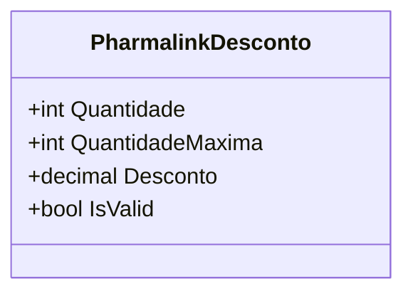

# PharmalinkDesconto
**Namespace**: IsthmusWinthor.Dominio.POCO.Precos  
**Nome do Arquivo**: PharmalinkDesconto.cs  

## Visão Geral e Responsabilidade
A classe `PharmalinkDesconto` representa uma estrutura de desconto aplicado na farmacêutica com base na quantidade de produtos adquiridos. O principal objetivo desta classe é encapsular a lógica necessária para validar se um desconto é aplicável, garantindo que ele só seja considerado válido se maior que zero. Isso assegura que a aplicação do desconto somente ocorra em circunstâncias favoráveis, evitando assim erros de cálculo que poderiam levar a perdas financeiras ou insatisfação do cliente.

## Métodos de Negócio
- **Título**: IsValid (Propriedade)
  - **Objetivo**: Garante que o desconto é positivo para ser considerado válido.
  - **Comportamento**: A propriedade avalia a condição que verifica se o valor do desconto (`Desconto`) é maior que zero.
  - **Retorno**: Retorna um valor booleano (`true` ou `false`), indicando se o desconto é válido.

## Propriedades Calculadas e de Validação
- **IsValid**: Esta propriedade calcula se o desconto é válido com base no valor do desconto. A regra é que um desconto deve ser maior que zero para ser considerado aplicável (`Desconto > 0`).

## Navigations Property
- Nenhuma navigations property complexa foi identificada nesta classe.

## Tipos Auxiliares e Dependências
- Nenhum enumerador ou classe auxiliar foi utilizado nesta classe.

## Diagrama de Relacionamentos

Esta documentação fornece uma visão clara das responsabilidades e regras de negócio relacionadas à classe `PharmalinkDesconto`, garantindo que qualquer desenvolvedor ou parte interessada entenda seu propósito e funcionamento dentro do sistema.
