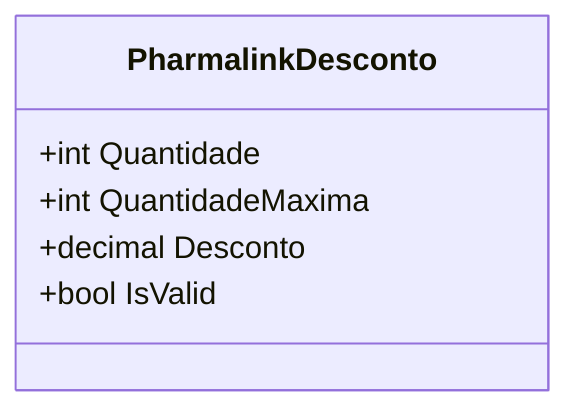

# PharmalinkDesconto
**Namespace**: IsthmusWinthor.Dominio.POCO.Precos  
**Nome do Arquivo**: PharmalinkDesconto.cs

Esta classe serve como um modelo de transporte de dados para representar descontos aplicáveis a produtos da Pharmalink. Ela encapsula informações pertinentes à quantidade de produtos e ao valor do desconto, assegurando que as regras de negócio associadas a esses dados sejam respeitadas.

### Propriedades Calculadas e de Validação
- **IsValid**: 
  - Regra: Esta propriedade avalia se o desconto é válido, garantindo que o valor do desconto seja superior a zero. Isso assegura que um desconto só será considerado aplicável se houver um valor positivo definido.

### Tipos Auxiliares e Dependências
- Não há enumeradores ou classes auxiliares referenciadas nesta classe.

### Diagrama de Relacionamentos

---
Gerada em 29/12/2025 21:51:21
