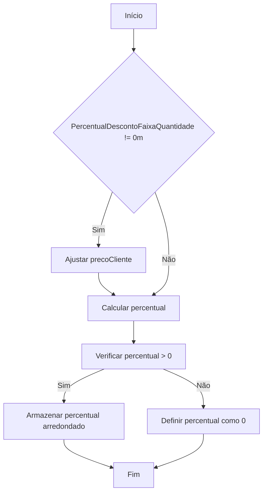
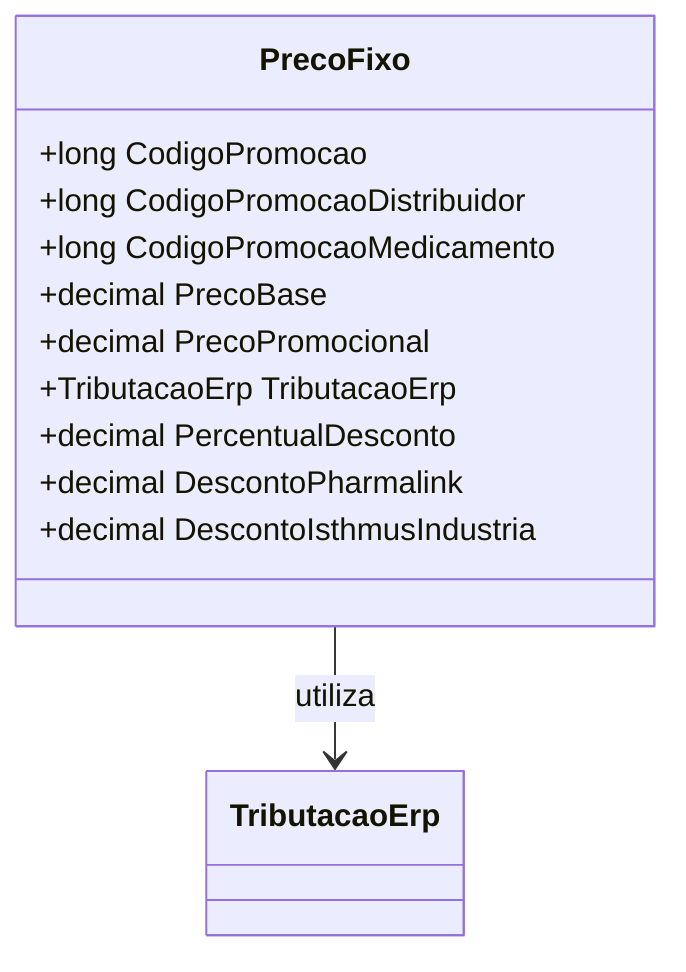

# PrecoFixo
**Namespace**: IsthmusWinthor.Dominio.POCO.Precos  
**Nome do Arquivo**: PrecoFixo.cs  

## Visão Geral e Responsabilidade
A classe `PrecoFixo` representa a modelagem de preços fixos de produtos, integrando diferentes códigos de promoção e permitindo o cálculo de descontos baseado em condições comerciais específicas. Ela resolve o problema de aplicação de promoções múltiplas, cálculos de percentuais de desconto e a adaptação dinâmica do preço baseado em condições variadas de venda.

## Métodos de Negócio

### CalcularPercentualDesconto (public)
- **Objetivo**: Este método garante que o percentual de desconto a ser aplicado no preço do cliente considere quaisquer acréscimos ou descontos adicionais definidos no objeto `PrecoFixo`.
- **Comportamento**:
  1. Verifica se existe um percentual de desconto baseado em faixas de quantidade.
  2. Se existir, ajusta o `precoCliente` subtraindo o desconto aplicado.
  3. Calcula o percentual de desconto em relação ao `PrecoPromocional`.
  4. Armazena o percentual arredondado na propriedade `PercentualDesconto`, garantindo que não seja negativo.
- **Retorno**: O método não retorna um valor, mas atualiza a propriedade `PercentualDesconto`.

### AplicarCondicaoPharmalink (public)
- **Objetivo**: Aplica um desconto específico baseado em condições Pharmlink ao preço promocional do produto.
- **Comportamento**:
  1. Calcula o novo `PrecoPromocional` subtraindo o percentual de desconto fornecido.
  2. Armazena o valor do desconto aplicado na propriedade `DescontoPharmalink`.
- **Retorno**: O método não retorna um valor, mas atualiza `PrecoPromocional` e `DescontoPharmalink`.

### AplicarCondicaoIsthmusIndustria (public)
- **Objetivo**: Aplica um desconto específico fornecido pela indústria ao preço promocional do produto.
- **Comportamento**:
  1. Calcula o novo `PrecoPromocional` subtraindo o percentual de desconto fornecido.
  2. Armazena o valor do desconto aplicado na propriedade `DescontoIsthmusIndustria`.
- **Retorno**: O método não retorna um valor, mas atualiza `PrecoPromocional` e `DescontoIsthmusIndustria`.

## Propriedades Calculadas e de Validação

### DescricaoVencimetoPromocao
- **Regra**: Retorna uma string formatada que representa a data de término da promoção caso exista. Se não houver uma data final, retorna uma string vazia.

### DescricaoCondicaoPromocao
- **Regra**: Verifica se a promoção se aplica por quantidade, retornando uma descrição formatada que indica as condições de quantidade para a promoção.

## Navigations Property
- [TributacaoErp](TributacaoErp.md)

## Tipos Auxiliares e Dependências
- **Enums**:
  - Nenhum
- **Classes Estáticas/Helpers**:
  - [TributacaoErp](TributacaoErp.md)

## Diagrama de Relacionamentos

---
Gerada em 29/12/2025 21:51:44
