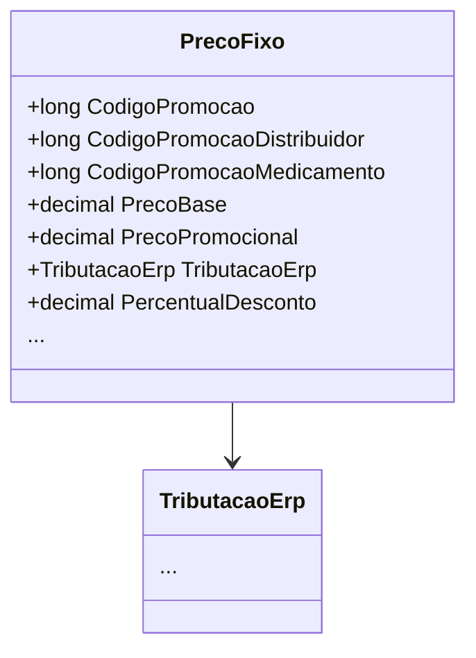

# PrecoFixo
**Namespace**: IsthmusWinthor.Dominio.POCO.Precos  
**Nome do Arquivo**: PrecoFixo.cs  

## Visão Geral e Responsabilidade
A classe `PrecoFixo` representa uma estrutura de preços aplicáveis aos medicamentos e produtos, incorporando lógicas específicas para cálculo de descontos e condições promocionais. Seu objetivo principal é gerenciar e calcular preços promocionais com base em regras de negócio, levando em consideração condições como quantidade e promoções específicas para distribuidoras ou produtos.

## Métodos de Negócio

### Título: `CalcularPercentualDesconto` (public)
- **Objetivo**: Garante a correta determinação do percentual de desconto aplicável ao preço de venda promocional com base no preço do cliente.
- **Comportamento**:
  1. Verifica se o `PercentualDescontoFaixaQuantidade` é diferente de zero.
  2. Se houver um desconto aplicado, reduz o `precoCliente` de acordo com esse percentual.
  3. Calcula o percentual de desconto considerando a diferença entre o preço do cliente e o preço promocional.
  4. Armazena o valor calculado em `PercentualDesconto`, arredondando-o para o número de casas decimais especificado.
- **Retorno**: Este método não retorna valor, mas atualiza a propriedade `PercentualDesconto`.

### Título: `AplicarCondicaoPharmalink` (public)
- **Objetivo**: Aplica um desconto específico relacionado ao Pharmalink no preço promocional.
- **Comportamento**:
  1. Calcula o novo `PrecoPromocional` considerando o desconto recebido.
  2. Armazena o valor do desconto aplicado na propriedade `DescontoPharmalink`.
- **Retorno**: Este método não retorna valor, mas atualiza as propriedades `PrecoPromocional` e `DescontoPharmalink`.

### Título: `AplicarCondicaoIsthmusIndustria` (public)
- **Objetivo**: Aplica um desconto específico relacionado à Isthmus na indústria ao preço promocional.
- **Comportamento**:
  1. Similar ao método anterior, recalcula o `PrecoPromocional` com base no desconto fornecido.
  2. Armazena o valor do desconto na propriedade `DescontoIsthmusIndustria`.
- **Retorno**: Este método não retorna valor, mas atualiza as propriedades `PrecoPromocional` e `DescontoIsthmusIndustria`.

## Propriedades Calculadas e de Validação

### Propriedade: `CodigoPromocao`
- **Regra**: Retorna o `CodigoPromocaoMedicamento` se este for maior que zero, caso contrário, fornece o `CodigoPromocaoDistribuidor`.

### Propriedade: `DescricaoCondicaoPromocao`
- **Regra**: Retorna uma descrição das condições promocionais em função da quantidade, utilizando lógica interna da classe.

### Propriedade: `DescricaoVencimetoPromocao`
- **Regra**: Retorna uma descrição de vencimento da promoção formatada, se `DataFim` estiver definida.

## Navigation Properties

- `TributacaoErp`: `[TributacaoErp](TributacaoErp.md)`

## Tipos Auxiliares e Dependências

- `TributacaoErp`: `[TributacaoErp](TributacaoErp.md)`

## Diagrama de Relacionamentos

