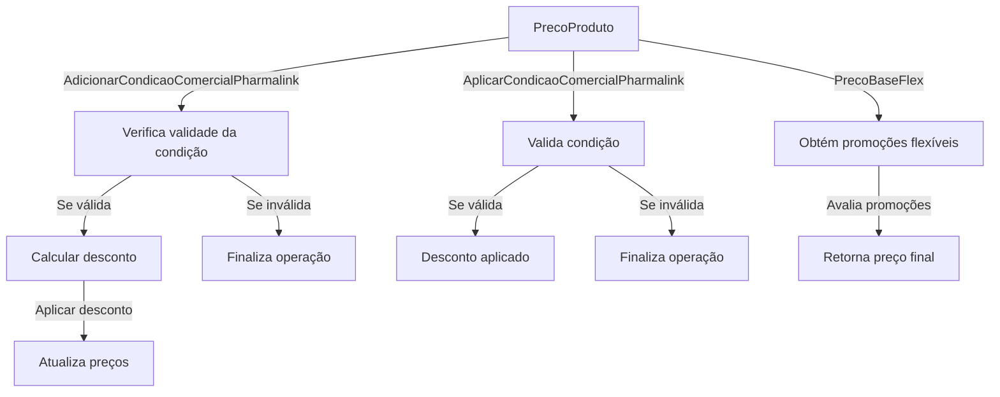
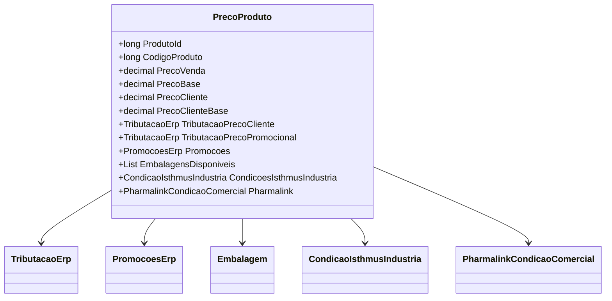

# PrecoProduto
- **Namespace**: IsthmusWinthor.Dominio.POCO.Precos
- **Nome do Arquivo**: PrecoProduto.cs

## Visão Geral e Responsabilidade
A classe `PrecoProduto` representa a estrutura de preços de um produto em um sistema de gerenciamento de preços, incluindo lógica para calcular preços de venda, condições de promoção, e propriedades tributárias. O objetivo central é garantir que os preços sejam calculados corretamente com base em regras de negócio como promoções, condições comerciais e tributação, de forma a otimizar a estratégia de vendas e garantir a conformidade com as leis fiscais.

## Métodos de Negócio

### 1. AdicionarCondicaoComercialPharmalink(PharmalinkCondicaoComercial condicaoComercial)
- **Objetivo**: Adiciona uma condição comercial do tipo Pharmalink a um produto.
- **Comportamento**:
  1. Define a propriedade `Pharmalink` com a condição comercial recebida.
  2. Reseta os valores do hash e ID da condição comercial.
  3. Se a condição não for válida, termina a execução.
  4. Calcula o desconto aplicável usando a quantidade solicitada.
  5. Aplica o desconto ao melhor preço e outras condições de preço fixo, combos e combinações de promoção.
- **Retorno**: Não possui retorno.

### 2. AplicarCondicaoComercialPharmalink(decimal quantidadeSolicitada)
- **Objetivo**: Aplica as condições da promoção Pharmalink ao preço do produto, se aplicável.
- **Comportamento**:
  1. Verifica se a condição Pharmalink é válida.
  2. Solicita o desconto para a quantidade e calcula o novo preço usando regras específicas.
  3. Aplica o desconto nos diversos tipos de promoções e condições associadas.
- **Retorno**: Não possui retorno.

### 3. PrecoBaseFlex()
- **Objetivo**: Calcula o preço base flexível em conformidade com várias regras de promoção e ajustes.
- **Comportamento**:
  1. Obtém as promoções flexíveis e suas condições.
  2. Avalia e seleciona a melhor promoção baseando-se nos percentuais de desconto.
  3. Aplica lógica complexa para determinar o preço final a partir de várias condições.
- **Retorno**: O preço calculado com base nas regras de flexibilidade.

## Propriedades Calculadas e de Validação
- **PrecoVenda**: Calcula o preço de venda considerando se uma promoção está ativa e arredonda conforme `QuantidadeCasasDecimais`.
- **PrecoBase**: Similar ao campo `PrecoVenda`, mas sem impostos. Retorna com base em promoções, dependendo da disponibilidade da embalagem.
- **ValorSt**, **ValorFecp**, **ValorIpi**: Valores tributários que variam se uma promoção está ativa. 
- **PrecoVendaUnitario**: Calcula o preço unitário de venda a partir da quantidade de unidade de caixa, caso exista.

## Navigations Property
- [TributacaoErp](TributacaoErp.md)
- [PromocoesErp](PromocoesErp.md)
- [Embalagem](Embalagem.md)
- [CondicaoIsthmusIndustria](CondicaoIsthmusIndustria.md)
- [PharmalinkCondicaoComercial](PharmalinkCondicaoComercial.md)

## Tipos Auxiliares e Dependências
- **Enumeradores**:
  - [TipoPromocaoEnum](TipoPromocaoEnum.md)
  - [OperacaoVerbaIndustriaEnum](OperacaoVerbaIndustriaEnum.md)

## Diagrama de Relacionamentos

