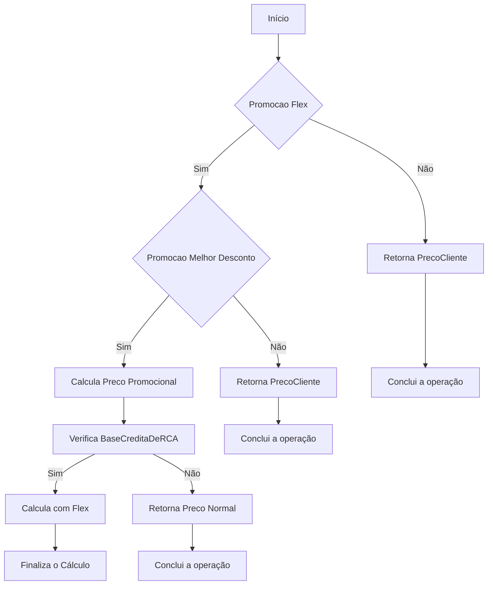
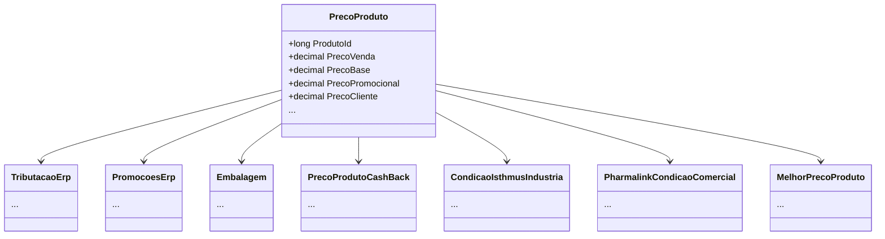

# PrecoProduto
**Namespace**: IsthmusWinthor.Dominio.POCO.Precos  
**Nome do Arquivo**: PrecoProduto.cs  

## Visão Geral e Responsabilidade
A classe `PrecoProduto` é responsável por gerenciar a lógica de preços de produtos no contexto de vendas, considerando diversas variáveis e promoções que impactam os preços de venda ao consumidor. Ela permite calcular preços promocionais, aplicar regras de desconto e determinar preços baseados em diversas condições, contribuindo para um sistema de precificação robusto e dinâmico.

## Métodos de Negócio

### Título: AdicionarCondicaoComercialPharmalink (public)
- **Objetivo**: Aplicar a condição comercial relativa ao Pharmalink em um produto, integrando regras específicas de determinados descontos e promoções.
- **Comportamento**: 
  1. Limpa os campos de hash e ID da condição comercial do Pharmalink.
  2. Verifica se a condição comercial é válida.
  3. Calcula o desconto para a quantidade solicitada.
  4. Ajusta o preço promocional do produto com base no desconto obtido.
  5. Aplica várias condições de promoção associadas ao Pharmalink nos preços principais e promocionais.
- **Retorno**: Não retorna valor, mas altera o estado do objeto.

### Título: PrecoBaseFlex (public)
- **Objetivo**: Calcular o preço base flexível do produto considerando as condições de promoções e descontos aplicáveis.
- **Comportamento**: 
  1. Avalia promoções flexíveis aplicadas ao preço do cliente e ao preço flexível.
  2. Compara o desconto das promoções disponíveis e decide qual utilizar com base em regras predefinidas.
  3. Retorna o preço mais relevante que se aplica às condições atuais, levando em conta os parâmetros de controle estabelecidos.
- **Retorno**: Decimal representando o preço base efetivo de acordo com as promoções e regras aplicáveis.

## Propriedades Calculadas e de Validação
- **PrecoVenda**: Calcula o preço de venda, consideranto se existe promoção e arredondando de acordo com a quantidade de casas decimais.
- **PrecoBase**: Similar ao `PrecoVenda`, mas fornece o preço sem os impostos, aplicando as mesmas regras de arredondamento.

## Navigations Property
- [TributacaoErp](TributacaoErp.md)
- [PromocoesErp](PromocoesErp.md)
- [Embalagem](Embalagem.md)
- [PrecoProdutoCashBack](PrecoProdutoCashBack.md)
- [CondicaoIsthmusIndustria](CondicaoIsthmusIndustria.md)
- [PharmalinkCondicaoComercial](PharmalinkCondicaoComercial.md)
- [MelhorPrecoProduto](MelhorPrecoProduto.md)

## Tipos Auxiliares e Dependências
- Enumerador: [TipoPromocaoEnum](TipoPromocaoEnum.md)
- Enumerador: [OperacaoVerbaIndustriaEnum](OperacaoVerbaIndustriaEnum.md)

## Diagrama de Relacionamentos

---
Gerada em 29/12/2025 21:52:06
