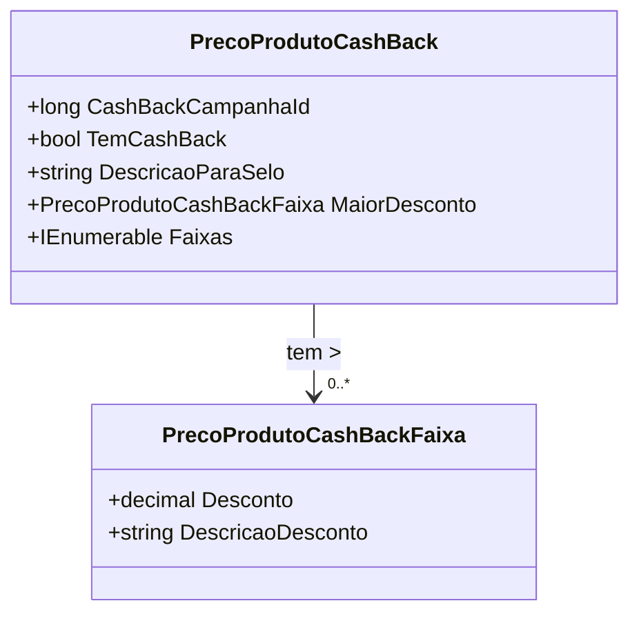

# PrecoProdutoCashBack
**Namespace**: IsthmusWinthor.Dominio.POCO.Precos  
**Nome do Arquivo**: PrecoProdutoCashBack.cs  

## Visão Geral e Responsabilidade
A classe `PrecoProdutoCashBack` representa uma campanha de cashback preferencial para produtos. O objetivo principal dessa classe é gerenciar e fornecer informações relacionadas a diferentes faixas de desconto associadas a uma campanha de cashback. Isso permite que o sistema determine se um produto é elegível para cashback, qual a maior faixa de desconto disponível e descreva essa informação de forma apropriada.

## Métodos de Negócio

### 1. MaiorDesconto (Propriedade)
- **Objetivo**: Garante que a maior faixa de desconto dentro das faixas de cashback seja sempre retornada, permitindo decisões de negócios informadas sobre a oferta de cashback.
- **Comportamento**: 
  1. Verifica se há faixas na lista `Faixas`.
  2. Se não existir nenhuma faixa, retorna uma nova instância de `PrecoProdutoCashBackFaixa`.
  3. Caso haja faixas, ordena as faixas de desconto em ordem decrescente e retorna a primeira (a maior).
- **Retorno**: Retorna um objeto do tipo `PrecoProdutoCashBackFaixa`, representando a faixa de desconto com o maior valor.

### 2. TemCashBack (Propriedade)
- **Objetivo**: Determina se o produto tem qualquer cashback associado.
- **Comportamento**: 
  - Verifica se o desconto da maior faixa (`MaiorDesconto`) é maior que zero.
- **Retorno**: Retorna um valor booleano (`true` ou `false`) que indica a presença de cashback para o produto.

### 3. DescricaoParaSelo (Propriedade)
- **Objetivo**: Fornece uma descrição formatada para exibir um selo de promoção de cashback.
- **Comportamento**: 
  1. Verifica se existe cashback (`TemCashBack`).
  2. Se não houver, retorna uma string vazia.
  3. Se houver cashback, obtém a descrição da maior faixa de desconto (`MaiorDesconto.DescricaoDesconto`).
  4. Formata a string resultante como “até {descricao}”.
- **Retorno**: Retorna uma string que representa a descrição do cashback se aplicável.

```mermaid
flowchart TD
    A[TemCashBack]
    B{MaiorDesconto}
    C[Desconto > 0]
    D[Descrição retornada]
    E[""]
    
    A --> B
    B -->|Maior Desconto| C
    C -->|Sim| D
    C -->|Não| E
```

## Propriedades Calculadas e de Validação
- `TemCashBack`: Valida se existe uma faixa de desconto maior que zero garantindo a lógica do cashback.
- `MaiorDesconto`: Calcula a maior faixa de desconto dentre as disponíveis.

## Navigations Property
- `Faixas`: Representa uma coleção de faixas de cashback. Cada faixa é do tipo [PrecoProdutoCashBackFaixa](PrecoProdutoCashBackFaixa.md).

## Tipos Auxiliares e Dependências
- [PrecoProdutoCashBackFaixa](PrecoProdutoCashBackFaixa.md)

## Diagrama de Relacionamentos

---
Gerada em 29/12/2025 21:52:22
