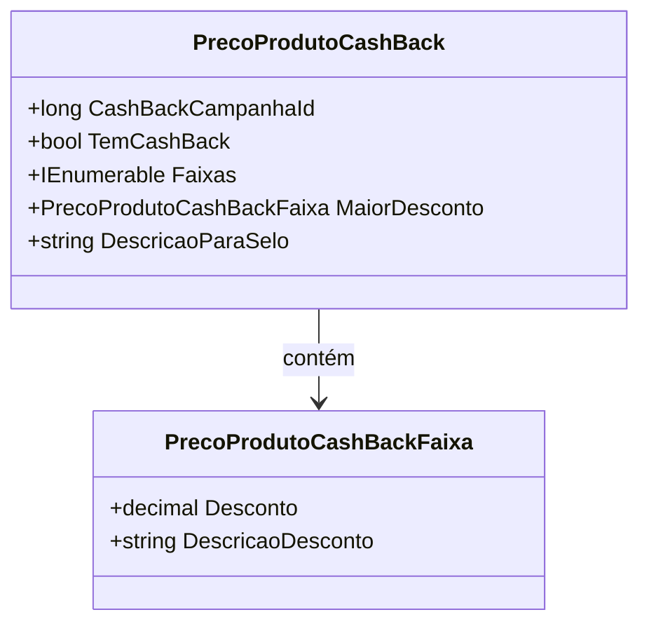

# PrecoProdutoCashBack
**Namespace**: IsthmusWinthor.Dominio.POCO.Precos  
**Nome do Arquivo**: PrecoProdutoCashBack.cs  

## Visão Geral e Responsabilidade
A classe `PrecoProdutoCashBack` representa uma campanha de cashback preferencial associada a um produto. O objetivo principal dessa classe é calcular e gerenciar os descontos disponíveis para produtos em campanhas de cashback, permitindo ao sistema determinar se um produto qualifica para cashback e qual é o maior desconto disponível.

## Métodos de Negócio

### Título: `TemCashBack` (Propriedade)
- **Objetivo**: Determinar se o produto participa de uma campanha de cashback com um desconto aplicável.
- **Comportamento**: 
  1. Avalia se a propriedade `MaiorDesconto` possui um valor.
  2. Checa se o desconto daquele valor é maior que 0.
  3. Retorna `true` se o desconto é maior que 0, caso contrário retorna `false`.
- **Retorno**: `true` indica que o produto tem cashback ativo, enquanto `false` indica que não tem.

### Título: `MaiorDesconto` (Propriedade)
- **Objetivo**: Encontrar e retornar a faixa de desconto com o maior valor disponível para o produto.
- **Comportamento**:
  1. Verifica se a coleção `Faixas` contém elementos.
  2. Se não houver faixas, retorna uma nova instância padrão de `PrecoProdutoCashBackFaixa`.
  3. Caso haja faixas, ordena-as por desconto de forma decrescente e retorna a primeira da lista, que representa a maior.
- **Retorno**: Retorna uma instância de `PrecoProdutoCashBackFaixa` que representa a faixa de desconto mais alta ou uma nova faixa padrão se não houver faixas disponíveis.

### Título: `DescricaoParaSelo` (Propriedade)
- **Objetivo**: Fornecer uma descrição formatada do maior desconto que pode ser utilizada em etiquetas promocionais.
- **Comportamento**:
  1. Verifica se o produto tem um cashback ativo usando `TemCashBack`.
  2. Se não houver cashback, retorna uma string vazia.
  3. Se houver, obtém a descrição do maior desconto utilizando `MaiorDesconto.DescricaoDesconto`.
  4. Retorna a string formatada "até {descricao}" onde {descricao} é o texto representando o maior desconto.
- **Retorno**: Uma string que representa a descrição do desconto ou uma string vazia se não houver cashback.

## Propriedades Calculadas e de Validação
- **Maior Desconto**: A propriedade `MaiorDesconto` calcula a faixa que possui o maior desconto através de uma operação de ordenação na lista de `Faixas`. Essa lógica garante que sempre seja apresentado o melhor desconto disponível.

## Navigations Property
- `[PrecoProdutoCashBackFaixa](PrecoProdutoCashBackFaixa.md)`: A classe `PrecoProdutoCashBackFaixa` representa as diversas faixas de desconto que um produto pode ter sob a campanha de cashback.

## Tipos Auxiliares e Dependências
- `[PrecoProdutoCashBackFaixa](PrecoProdutoCashBackFaixa.md)`: Utilizada para representar as faixas de desconto associadas ao cashback.
  
## Diagrama de Relacionamentos

