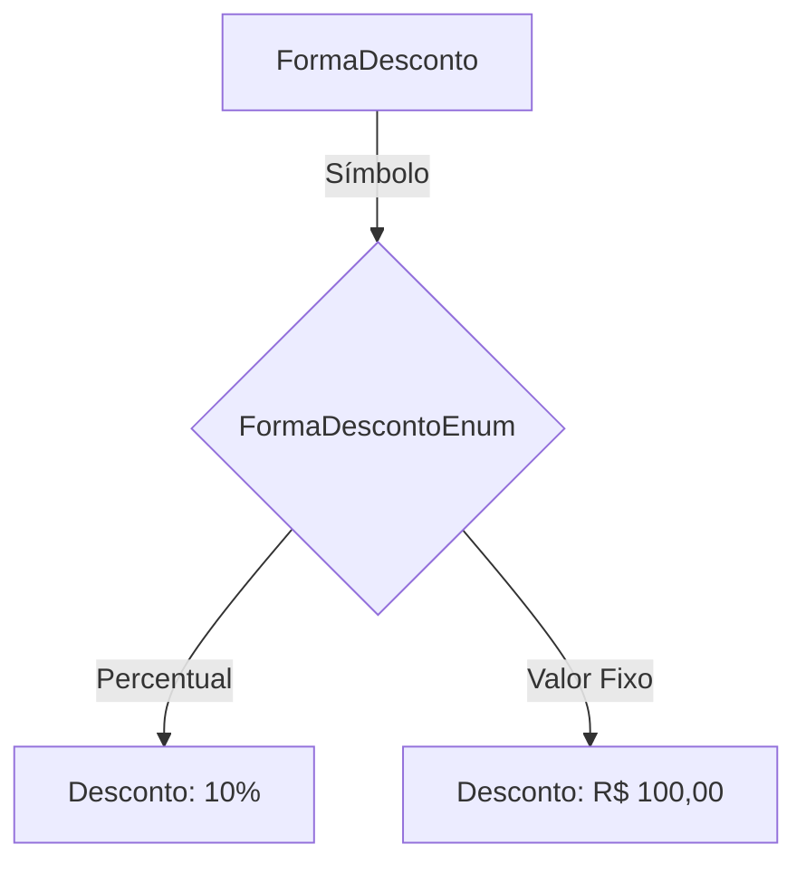
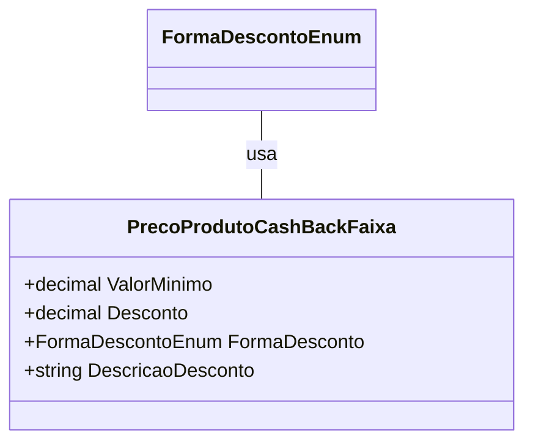

# PrecoProdutoCashBackFaixa
**Namespace**: IsthmusWinthor.Dominio.POCO.Precos  
**Nome do Arquivo**: PrecoProdutoCashBackFaixa.cs  

## Visão Geral e Responsabilidade
A classe `PrecoProdutoCashBackFaixa` representa uma faixa de preços para produtos que oferecem um sistema de cashback. Seu papel é fornecer a estrutura necessária para a definição de valores mínimos, descontos aplicáveis e a forma como esses descontos são representados (se em percentual ou valor absoluto). Esta classe é fundamental para a implementação de regras de negócios que otimizam a experiência do cliente ao aplicar descontos em compras.

## Métodos de Negócio

### Título: DescricaoDesconto (Propriedade)

- **Objetivo**: Garante que a representação do desconto esteja formatada corretamente conforme a forma de desconto definida. Proporciona uma visualização amigável e compreensível do valor do desconto.

- **Comportamento**: 
  1. Verifica se a forma de desconto é percentual.
  2. Se for percentual, formata o `Desconto` como uma string percentual.
  3. Caso contrário, utiliza um método auxiliar `ToMoney()` para formatar o valor do desconto em moeda.

- **Retorno**: Retorna uma string que representa a forma do desconto, podendo ser uma porcentagem (ex: "10%") ou um valor monetário (ex: "R$ 100,00").

## Propriedades Calculadas e de Validação

### DescricaoDesconto
- **Regra**: A formatação do desconto depende da enumeração `FormaDescontoEnum`. Se o desconto é percentual, ele é formatado como uma porcentagem; caso contrário, é exibido como um valor monetário. Esta abordagem garante que o usuário da classe sempre obtenha uma representação correta e intuitiva do desconto.

## Navigations Property
- Não há Navegações de Propriedades na classe `PrecoProdutoCashBackFaixa`.

## Tipos Auxiliares e Dependências
- `[FormaDescontoEnum](FormaDescontoEnum.md)`

## Diagrama de Relacionamentos

