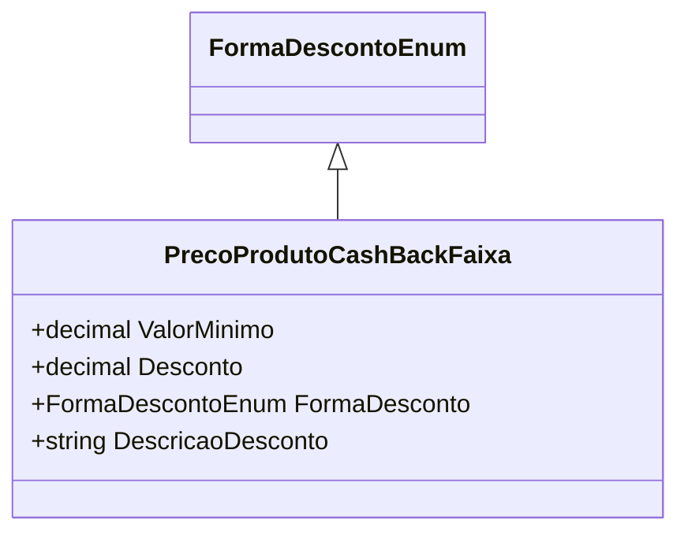

# PrecoProdutoCashBackFaixa
**Namespace**: IsthmusWinthor.Dominio.POCO.Precos  
**Nome do Arquivo**: PrecoProdutoCashBackFaixa.cs  

## Visão Geral e Responsabilidade
A classe `PrecoProdutoCashBackFaixa` representa uma faixa de preços para produtos que aplicam cashback. Ela se encarrega de definir um intervalo de valores onde um desconto pode ser aplicado, além de fornecer a descrição formatada desse desconto com base na forma de cálculo do mesmo. O problema de negócio que ela resolve é garantir que as regras de desconto sejam aplicadas corretamente, permitindo uma experiência de compra mais transparente ao usuário.

## Propriedades Calculadas e de Validação
### DescriçãoDesconto
- **Regra**: Esta propriedade fornece uma descrição do desconto que pode ser aplicado. O cálculo do valor que será exibido depende da forma de desconto:
  - Se a `FormaDesconto` for do tipo `Percentual`, a propriedade retorna o desconto formatado em porcentagem.
  - Se a `FormaDesconto` for de outro tipo, retorna o desconto como um valor monetário.

## Navigations Property
Não há propriedades que sejam classes complexas do domínio nesta classe.

## Tipos Auxiliares e Dependências
- Enumerador: [FormaDescontoEnum](FormaDescontoEnum.md)

## Diagrama de Relacionamentos

---
Gerada em 29/12/2025 21:52:31
