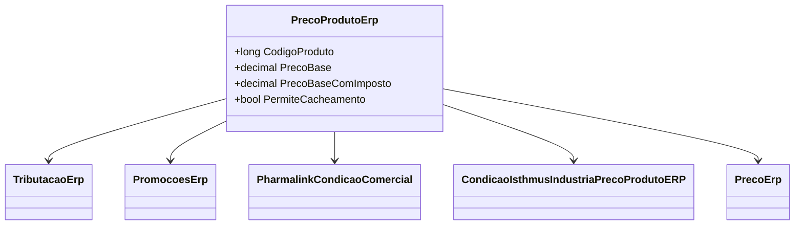

```markdown
# PrecoProdutoErp
- **Namespace**: IsthmusWinthor.Dominio.POCO.Precos
- **Nome do Arquivo**: PrecoProdutoErp.cs

## Visão Geral e Responsabilidade
A classe `PrecoProdutoErp` representa a entidade que encapsula as informações de preços de produtos dentro do sistema ERP. Sua principal responsabilidade é calcular e gerenciar os preços dos produtos considerando tributações, condições comerciais e promoções, permitindo que as empresas determinem estratégias de preços adequados em função de diversas regras de negócio.

## Métodos de Negócio

### AdicionarCondicaoComercialPharmalink (public)
- **Objetivo**: Adicionar uma condição comercial específica da Pharmalink ao objeto atual. Garante que a condição comercial esteja definida corretamente na estrutura do preço do produto.
- **Comportamento**: 
  1. Recebe uma instância da classe `PharmalinkCondicaoComercial`.
  2. Se a instância não for nula, a condição comercial é atualizada. Caso contrário, uma nova instância padrão é criada e atribuída.
- **Retorno**: Este método não retorna um valor, mas altera o estado interno da classe `PrecoProdutoErp`.

### RemoverCondicaoComercialPharmalink (public)
- **Objetivo**: Remover a condição comercial específica da Pharmalink do objeto atual.
- **Comportamento**:
  1. Chama o método `AdicionarCondicaoComercialPharmalink` passando `null`, o que resulta na definição de uma nova instância padrão da condição comercial.
- **Retorno**: Este método não retorna um valor, mas altera o estado interno da classe.

### AdicionarCondicoesComerciaisIsthmusIndustria (public)
- **Objetivo**: Adicionar múltiplas condições comerciais do tipo `ICondicaoIsthmusIndustria` ao objeto atual.
- **Comportamento**:
  1. Recebe uma coleção de condições comerciais e um dicionário que associa filial a preços.
  2. Chama o método que adiciona as condições comerciais, utilizando o preço associado à filial atual, se existir.
- **Retorno**: Este método não retorna um valor, mas altera o estado interno da classe.

### RemoverCondicaoComercialIsthmusIndustria (public)
- **Objetivo**: Remover todas as condições comerciais do tipo Isthmus Indústria.
- **Comportamento**: 
  1. Chama o método `Reset` da propriedade `CondicoesIsthmusIndustria`, restaurando seu estado inicial.
- **Retorno**: Este método não retorna um valor, mas altera o estado interno da classe.

### InativarCacheObjeto (public)
- **Objetivo**: Inativar o cache do objeto atual.
- **Comportamento**: 
  1. Define a propriedade `PermiteCacheamento` como falsa, garantindo que o objeto não seja mais cacheado.
- **Retorno**: Este método não retorna um valor, mas altera o estado interno da classe.

## Propriedades Calculadas e de Validação

### PrecoBaseComImposto
- **Regra**: O preço base com impostos é calculado somando o preço base ao total de tributação aplicado (`TributacaoErp.TotalTributacao`). Esta propriedade garante que sempre que o preço base é acessado, ele inclui automaticamente os tributos.

### TaxaVarejo
- **Regra**: Essa propriedade calcula a taxa de varejo com base na lógica de que, se o índice de preço e a quantidade de atacado forem maiores que 1, retorna a diferença entre o preço baseado em índice e o preço base. Caso contrário, retorna 0. Isso ajuda a definir uma regra de cálculo condicional que impacta diretamente o preço de venda ao consumidor.

## Navigations Property

- [TributacaoErp](TributacaoErp.md)
- [PromocoesErp](PromocoesErp.md)
- [PharmalinkCondicaoComercial](PharmalinkCondicaoComercial.md)
- [CondicaoIsthmusIndustriaPrecoProdutoERP](CondicaoIsthmusIndustriaPrecoProdutoERP.md)
- [PrecoErp](PrecoErp.md)

## Tipos Auxiliares e Dependências
- [ICondicaoIsthmusIndustria](ICondicaoIsthmusIndustria.md)
- [TaxaComercial](TaxaComercial.md)

## Diagrama de Relacionamentos

```
