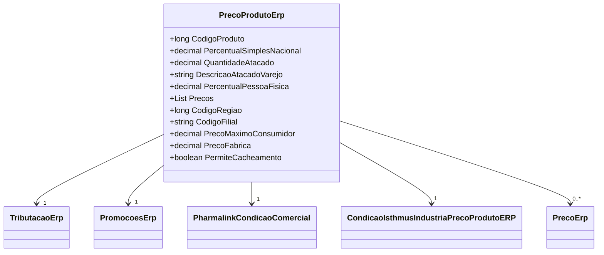

# PrecoProdutoErp
**Namespace**: IsthmusWinthor.Dominio.POCO.Precos  
**Nome do Arquivo**: PrecoProdutoErp.cs  

## Visão Geral e Responsabilidade
A classe `PrecoProdutoErp` representa a estrutura que define os preços de produtos dentro do sistema, levando em consideração diferentes parâmetros, como taxas, promoções e condições comerciais. Esta classe é responsável por garantir a integridade dos dados relacionados aos preços, além de realizar os cálculos necessários para representar corretamente o preço final ao consumidor, somando tributações e ajustando de acordo com as condições comerciais definidas.

## Métodos de Negócio

### AdicionarCondicaoComercialPharmalink (public)
- **Objetivo**: Este método atribui uma condição comercial específica ao atributo `Pharmalink`. Ele garante que uma condição comercial válida seja estabelecida ou inicializa com um novo objeto caso o argumento seja nulo.
- **Comportamento**: 
  1. Verifica se `condicaoComercial` não é nulo.
  2. Se não for nulo, atribui `condicaoComercial` à propriedade `Pharmalink`.
  3. Caso contrário, inicializa `Pharmalink` com um novo objeto.
- **Retorno**: Não retorna valor; o método altera o estado da propriedade `Pharmalink`.

### RemoverCondicaoComercialPharmalink (public)
- **Objetivo**: Este método remove a condição comercial atual do atributo `Pharmalink`, utilizando o método `AdicionarCondicaoComercialPharmalink`.
- **Comportamento**: 
  1. Chama o método `AdicionarCondicaoComercialPharmalink` passando `null` como argumento.
- **Retorno**: Não retorna valor.

### AdicionarCondicoesComerciaisIsthmusIndustria (public)
- **Objetivo**: Adiciona múltiplas condições comerciais para Isthmus Indústria, baseando-se em um dicionário que contém as filiais de preço do cliente.
- **Comportamento**: 
  1. Chama o método `AdicionarCondicoesComerciais` na propriedade `CondicoesIsthmusIndustria`.
  2. Verifica se a `CodigoFilial` existe no dicionário fornecido.
  3. Se existir, atribui o preço associado da filial; senão, atribui uma string vazia.
- **Retorno**: Não retorna valor.

### RemoverCondicaoComercialIsthmusIndustria (public)
- **Objetivo**: Este método reseta as condições comerciais para Isthmus Indústria.
- **Comportamento**: 
  1. Chama o método `Reset` na propriedade `CondicoesIsthmusIndustria`.
- **Retorno**: Não retorna valor.

### InativarCacheObjeto (public)
- **Objetivo**: Desabilita o cache do objeto, configurando a propriedade `PermiteCacheamento`.
- **Comportamento**: 
  1. Altera a propriedade `PermiteCacheamento` para `false`.
- **Retorno**: Não retorna valor.

## Propriedades Calculadas e de Validação
- **PrecoBaseComImposto**: Este é um cálculo que soma o `PrecoBase` com o valor total da tributação. Isso reflete o preço final do produto para o cliente, considerando impostos aplicáveis.
- **TaxaVarejo**: Calcula a diferença entre o preço base multiplicado pelo `IndicePreco` e o `PrecoBase`, somente se `IndicePreco` e `QuantidadeAtacado` forem superiores a 1. Isso reflete o desconto aplicável para compras em atacado.

## Navigations Property
- [TributacaoErp](TributacaoErp.md)
- [PromocoesErp](PromocoesErp.md)
- [PharmalinkCondicaoComercial](PharmalinkCondicaoComercial.md)
- [CondicaoIsthmusIndustriaPrecoProdutoERP](CondicaoIsthmusIndustriaPrecoProdutoERP.md)

## Tipos Auxiliares e Dependências
- [TaxaComercial](TaxaComercial.md)
- [ICondicaoIsthmusIndustria](ICondicaoIsthmusIndustria.md)

## Diagrama de Relacionamentos

---
Gerada em 29/12/2025 21:52:56
