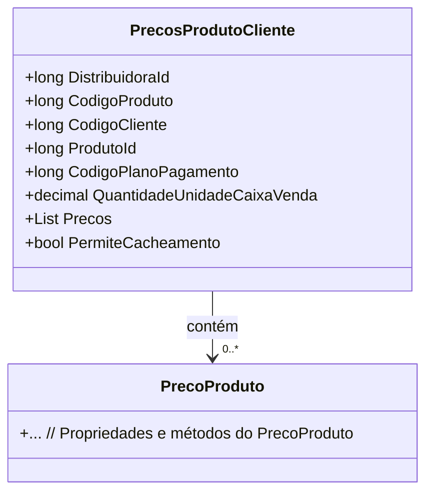

# PrecosProdutoCliente
- **Namespace**: IsthmusWinthor.Dominio.POCO.Precos
- **Nome do Arquivo**: PrecosProdutoCliente.cs

## Visão Geral e Responsabilidade
A classe `PrecosProdutoCliente` é um modelo de domínio que representa a relação entre produtos e clientes em um contexto de precificação. Seu principal objetivo é gerenciar os preços de produtos específicos para cada cliente, considerando variáveis como distribuidora, plano de pagamento e quantidade de venda. Ela garante que a lógica de precificação seja aplicada corretamente de acordo com as regras de negócio estabelecidas.

## Métodos de Negócio
Atualmente, a classe não contém métodos com lógica de negócio complexa, apenas propriedades para armazenar dados.

## Propriedades Calculadas e de Validação
Não existem propriedades na classe que implementem lógica no `get` ou validação no `set`.

## Navigation Properties
- `Precos` - Lista de preços de produtos: [PrecoProduto](PrecoProduto.md)

## Tipos Auxiliares e Dependências
Não existem enumeradores ou classes auxiliares mencionadas nesta classe.

## Diagrama de Relacionamentos

---
Gerada em 29/12/2025 21:53:05
