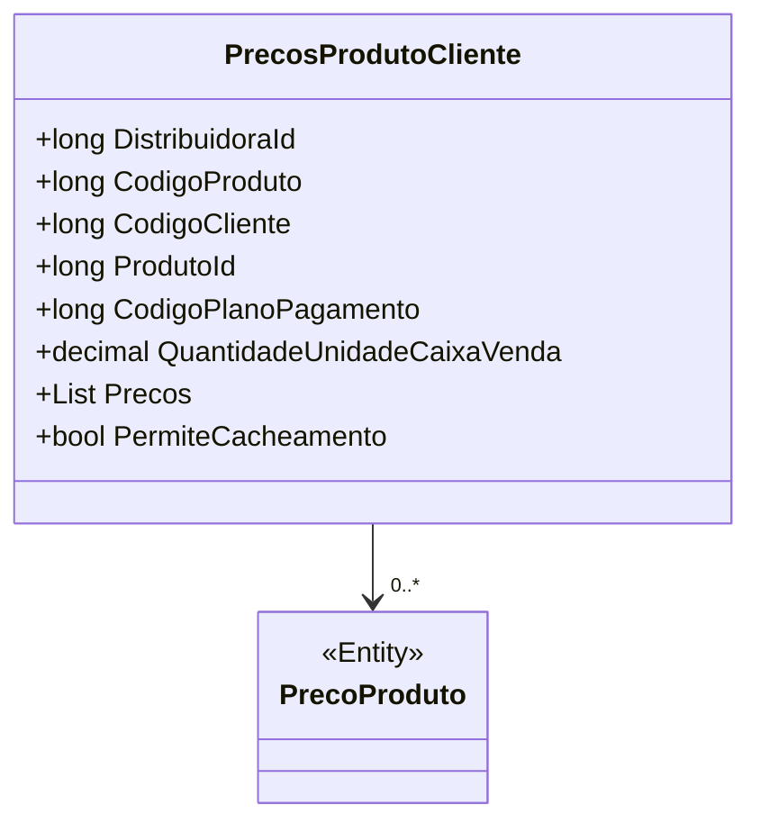

# PrecosProdutoCliente
**Namespace**: IsthmusWinthor.Dominio.POCO.Precos  
**Nome do Arquivo**: PrecosProdutoCliente.cs  

## Visão Geral e Responsabilidade
A classe `PrecosProdutoCliente` representa a estrutura de preços associados a um produto específico sob o contexto de uma distribuidora e de um cliente. Ela resolve o problema de definir e gerenciar os preços de produtos levando em consideração o cliente, a distribuidora, e o plano de pagamento, garantindo que os preços estejam adequadamente aplicados de acordo com as condições de venda e relacionamento.

## Métodos de Negócio
- **Título**: Não há métodos de negócio complexos presentes nesta classe, portanto esta seção não se aplica.

## Propriedades Calculadas e de Validação
- Não há propriedades com lógica no `get` ou validação no `set` nesta classe.

## Navigations Property
- `List<PrecoProduto> Precos`: Esta propriedade contém uma lista de preços de produtos que deve ser alimentada de acordo com as regras de negócio que definem como o preço é calculado com base no plano de pagamento e outras condições.
- `PrecoProduto` é presumivelmente uma classe que contém informações relacionadas a preços, pode ser referenciada com o arquivo `[PrecoProduto](PrecoProduto.md)`.

## Tipos Auxiliares e Dependências
- Nenhum enumerador ou classe auxiliar está explicitamente referenciado nesta classe.

## Diagrama de Relacionamentos

Esta documentação proporciona uma visualização clara das responsabilidades e das ligações da classe `PrecosProdutoCliente`, assegurando que os desenvolvedores compreendam sua estrutura e finalidade dentro do sistema.
