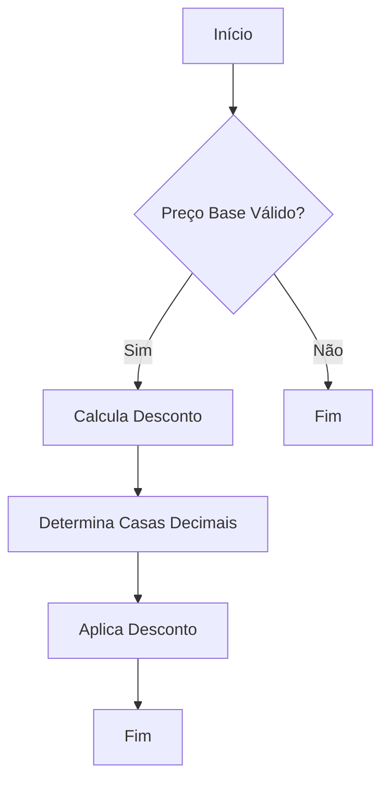
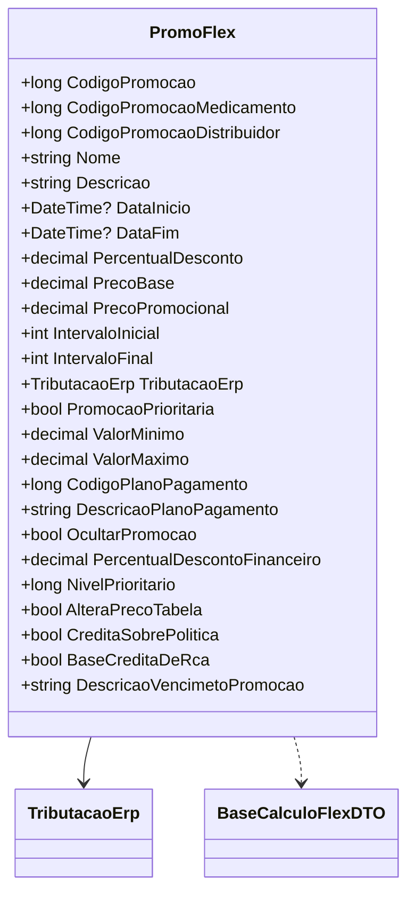

# PromoFlex
- **Namespace**: IsthmusWinthor.Dominio.POCO.Precos
- **Nome do Arquivo**: PromoFlex.cs

## Visão Geral e Responsabilidade
A classe `PromoFlex` representa uma promoção flexível aplicada a produtos, gerenciando informações sobre descontos, condições de aplicação e tributação. Ela é responsável por calcular o preço base ajustado com desconto e tributos e fornece regras de negócio para validar e aplicar promoções nos produtos, visando otimizar a gestão de vendas e promoções em um sistema de gestão.

## Métodos de Negócio

### AplicarDescontoProduto
- **Visibilidade**: Public
- **Objetivo**: Este método aplica um desconto ao preço do produto com base no percentual de desconto configurado e ajusta o valor considerando a quantidade de casas decimais apropriada.
- **Comportamento**:
    1. O método define uma função interna `QuantidadeCasasDecimaisPreco`, que analisa o preço base do cliente e determina a quantidade adequada de casas decimais.
    2. Calcula o preço base após a aplicação do desconto, arredondando-o com relação à quantidade de casas decimais determinada.
- **Retorno**: Este método não retorna um valor, mas altera a propriedade `PrecoBase` da classe.

### ParaBaseCalculoFlex
- **Visibilidade**: Public
- **Objetivo**: Este método transforma os dados da promoção para um formato DTO adequado para cálculo, capturando o percentual de desconto aplicado e condições de ajuste de preço.
- **Comportamento**:
    1. Calcula o percentual de desconto aplicando a fórmula com base no preço do cliente e no preço flex.
    2. Cria e retorna uma instância de `BaseCalculoFlexDTO` com as informações relevantes.
- **Retorno**: Retorna um objeto `BaseCalculoFlexDTO` que contém o percentual de desconto e as configurações de preço.

## Propriedades Calculadas e de Validação
### PrecoPromocional
- Regra: O preço promocional é calculado como a soma do preço base e do total de tributação (`TributacaoErp.TotalTributacao`), representando o preço final que será aplicado ao cliente.

### DescricaoVencimetoPromocao
- Regra: Esta propriedade exibirá a data de término da promoção formatada, caso a data esteja disponível, permitindo ao usuário entender a validade da promoção.

## Navigations Property
- `TributacaoErp`: Representa as regras tributárias aplicáveis à promoção. [TributacaoErp](TributacaoErp.md)

## Tipos Auxiliares e Dependências
- `BaseCalculoFlexDTO`: Tipo utilizado para transportar as informações de cálculo da promoção. [BaseCalculoFlexDTO](BaseCalculoFlexDTO.md)

## Diagrama de Relacionamentos

