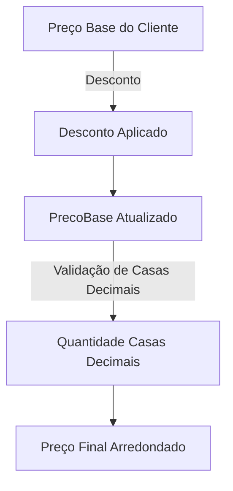
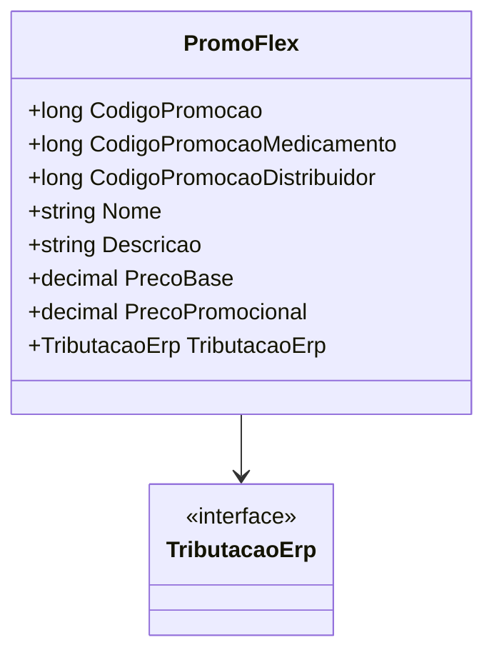

# PromoFlex
**Namespace**: IsthmusWinthor.Dominio.POCO.Precos  
**Nome do Arquivo**: PromoFlex.cs  

## Visão Geral e Responsabilidade
A classe `PromoFlex` representa uma promoção flexível que aplica descontos a produtos com base em diversos parâmetros, como códigos de promoção, períodos de validade e configuração tributária. O papel da classe é calcular e ajustar preços promocionais, assegurando que as regras de negócio relacionadas a promoções sejam aplicadas corretamente, permitindo uma gestão eficiente das vendas e promoções no ambiente de negócios.

## Métodos de Negócio

### AplicarDescontoProduto (public)
- **Objetivo**: Garante que o desconto percentual seja corretamente aplicado ao preço base do cliente, ajustando a quantidade de casas decimais conforme necessário.
- **Comportamento**: 
  1. Calcula a quantidade de casas decimais necessárias para o preço base, usando uma função interna.
  2. Aplica o desconto ao preço base do cliente calculando o valor com o percentual especificado.
  3. O preço final é arredondado de acordo com as regras de arredondamento definidas.
- **Retorno**: Este método não retorna nenhum valor, mas atualiza a propriedade `PrecoBase` com o resultado do cálculo do desconto.

### ParaBaseCalculoFlex (public)
- **Objetivo**: Converte informações de promoção para um objeto DTO que pode ser usado para cálculos adicionais na aplicação.
- **Comportamento**:
  1. Calcula o percentual de desconto aplicado em relação ao preço do cliente e ao preço flex digitado.
  2. Cria e retorna um objeto `BaseCalculoFlexDTO` com os dados relevantes.
- **Retorno**: Retorna um objeto `BaseCalculoFlexDTO` que contém informações sobre o desconto aplicado, se o preço da tabela foi alterado, e outras configurações relevantes.

## Propriedades Calculadas e de Validação
- **CodigoPromocao**: Calcula o código de promoção a ser usado com base na prioridade dos códigos disponíveis (`CodigoPromocaoMedicamento` ou `CodigoPromocaoDistribuidor`).
- **PrecoPromocional**: Calcula o preço promocional final ao somar o preço base e a tributação.

## Navigations Property
- **TributacaoErp**: [TributacaoErp](TributacaoErp.md)

## Tipos Auxiliares e Dependências
- [BaseCalculoFlexDTO](BaseCalculoFlexDTO.md)

## Diagrama de Relacionamentos

---
Gerada em 29/12/2025 21:54:36
