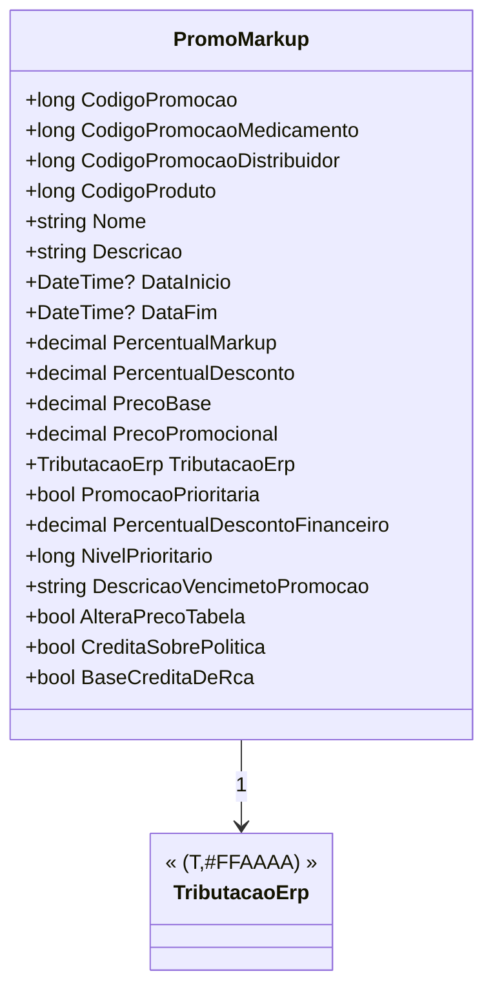

# PromoMarkup
**Namespace**: IsthmusWinthor.Dominio.POCO.Precos  
**Nome do Arquivo**: PromoMarkup.cs  

## Visão Geral e Responsabilidade
A classe `PromoMarkup` representa o registro de uma promoção de markup de um produto específico. Ela encapsula as regras de negócio relacionadas ao cálculo do preço promocional e à aplicação de descontos, permitindo a gestão de promoções em um sistema de vendas. Com isso, a classe busca otimizar a tomada de decisão sobre qual preço aplicar na transação, considerando hierarquias de promoções e informações tributárias.

## Métodos de Negócio

### Título: `CodigoPromocao` (public)
- **Objetivo**: Retornar o código de promoção aplicável ao produto, priorizando o código da promoção do medicamento, caso este seja válido.
- **Comportamento**: Se o valor de `CodigoPromocaoMedicamento` for maior que 0, `CodigoPromocao` retornará este valor. Caso contrário, retornará `CodigoPromocaoDistribuidor`.
- **Retorno**: O código de promoção aplicável, que pode ser utilizado para identificar a promoção vigente no contexto do produto.

### Título: `PrecoPromocional` (public)
- **Objetivo**: Calcular o preço promocional do produto considerando a tributação.
- **Comportamento**: Retorna a soma do `PrecoBase` e do total de tributação definido na instância de `TributacaoErp` associada.
- **Retorno**: O valor final que será aplicado como preço de venda promocional, incluindo tributações.

### Título: `DescricaoVencimetoPromocao` (public)
- **Objetivo**: Fornecer uma descrição legível sobre a data de término da promoção.
- **Comportamento**: Se `DataFim` tiver um valor, ele retorna a string formatada com a data; caso contrário, retorna uma string vazia.
- **Retorno**: Uma representação textual que informa até quando a promoção é válida, ou uma string vazia se não houver data de término.

## Propriedades Calculadas e de Validação
- **`PrecoPromocional`**: Calcula o preço promocional considerando a base de preço e a tributação do ERP.
- **`CodigoPromocao`**: Determina qual código de promoção usar com base na prioridade das promoções disponíveis.

## Navigation Property
- **`TributacaoErp`**: [TributacaoErp](TributacaoErp.md) - Representa as tributações associadas ao produto.

## Tipos Auxiliares e Dependências
- **`TributacaoErp`**: [TributacaoErp](TributacaoErp.md) - Classe que contém detalhes sobre a tributação de produtos.
- **Enums**: Nenhum enumerador foi utilizado nesta classe.

## Diagrama de Relacionamentos

---
Gerada em 29/12/2025 21:54:53
