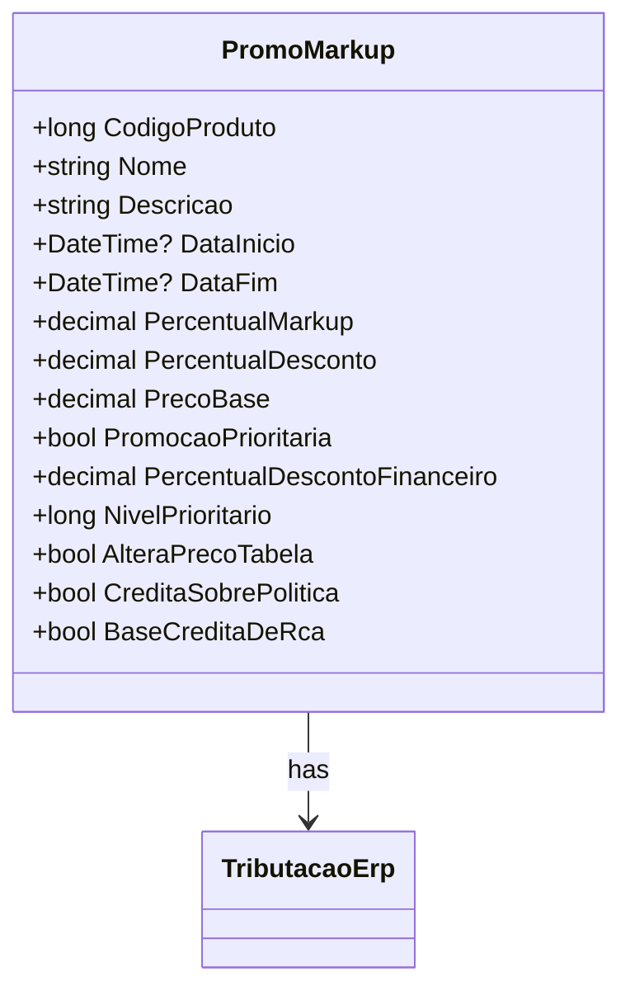

# PromoMarkup
**Namespace**: IsthmusWinthor.Dominio.POCO.Precos  
**Nome do Arquivo**: PromoMarkup.cs  

## Visão Geral e Responsabilidade
A classe `PromoMarkup` representa o registro de promoção de markup de um produto específico. Ela é responsável por armazenar as informações referentes a promoções aplicáveis, como códigos promocionais e detalhes de preços, permitindo que sistemas de vendas e gerenciamento de estoque acessem rapidamente as condições promocionais ativas. A classe facilita o cálculo do preço promocional, assegurando que a aplicação correta de descontas e tributações seja feita de acordo com as promoções vigentes.

## Métodos de Negócio

### Título: CodigoPromocao (public)
- **Objetivo**: Garante que, ao acessar a propriedade `CodigoPromocao`, seja retornado o código promocional do medicamento, caso ele exista, ou o código do distribuidor, garantindo integridade na seleção do código de promoção aplicável.
- **Comportamento**: 
  1. Verifica se `CodigoPromocaoMedicamento` é maior que 0.
  2. Se verdadeiro, retorna `CodigoPromocaoMedicamento`.
  3. Se falso, retorna `CodigoPromocaoDistribuidor`.
- **Retorno**: Retorna o código promocional aplicável como um `long`.

### Título: PrecoPromocional (public)
- **Objetivo**: Calcula o preço promocional do produto, considerando o preço base e a totalização das tributações aplicáveis.
- **Comportamento**:
  1. Acessa `PrecoBase`.
  2. Soma o valor de `PrecoBase` com `TributacaoErp.TotalTributacao`, onde `TotalTributacao` calcula a tributação do produto.
- **Retorno**: Retorna o preço promocional como um `decimal`.

### Título: DescricaoVencimetoPromocao (public)
- **Objetivo**: Gera uma descrição do vencimento da promoção, caso a data de fim esteja definida.
- **Comportamento**:
  1. Verifica se `DataFim` tem um valor.
  2. Se verdadeiro, formata a data para o padrão "dd/MM/yyyy" e cria uma string com a descrição "Até {DataFim}".
  3. Se falso, retorna uma string vazia.
- **Retorno**: Retorna uma string que representa o vencimento da promoção ou uma string vazia.

## Propriedades Calculadas e de Validação
- **CodigoPromocao**: Retorna o código de promoção apropriado com base nas regras de prioridade.
- **PrecoPromocional**: Calcula o preço promocional com base no preço base e na tributação total.
- **DescricaoVencimetoPromocao**: Fornece uma descrição formatada do vencimento da promoção, ou uma string vazia se não houver data.

## Navigations Property
- `[TributacaoErp](TributacaoErp.md)`: Representa a tributação referente ao produto pesquisado.

## Tipos Auxiliares e Dependências
- `[TributacaoErp](TributacaoErp.md)`: Classe que contém informações de tributação aplicáveis a um produto.
  
## Diagrama de Relacionamentos

