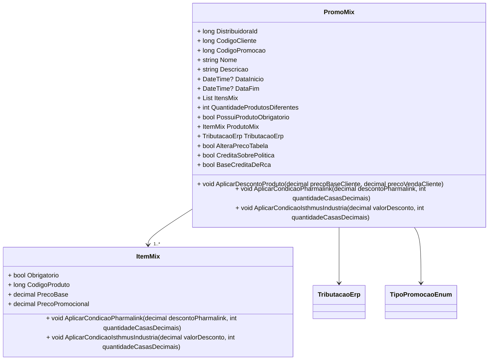

# PromoMix
**Namespace**: IsthmusWinthor.Dominio.POCO.Precos  
**Nome do Arquivo**: PromoMix.cs  

## Visão Geral e Responsabilidade
A classe `PromoMix` representa uma promoção no formato de "mix", onde o cliente deve adquirir um conjunto de produtos para se qualificar para descontos. O principal problema de negócio que essa classe resolve é a aplicação e validação de condições promocionais complexas que envolvem múltiplos produtos e suas respectivas regras de desconto.

## Métodos de Negócio

### AplicarDescontoProduto (public)
- **Objetivo**: Aplicar o desconto ao produto representado por `ProdutoMix`.
- **Comportamento**:
  1. Calcula o preço base do produto subtraindo o percentual de desconto do preço base informado.
  2. Calcula o preço promocional do produto subtraindo o percentual de desconto do preço de venda informado.
- **Retorno**: Este método não retorna nenhum valor.

### AplicarCondicaoPharmalink (public)
- **Objetivo**: Aplicar as condições de desconto específicas da Pharmalink ao `ProdutoMix` e a cada item do `ItensMix`.
- **Comportamento**:
  1. Aplica a condição Pharmalink ao `ProdutoMix` e a cada item em `ItensMix`.
  2. Caso o desconto já tenha sido aplicado, ignora a aplicação.
- **Retorno**: Este método não retorna nenhum valor.

### AplicarCondicaoIsthmusIndustria (public)
- **Objetivo**: Aplicar as condições de desconto específicas para Isthmus à `ProdutoMix` e a cada item do `ItensMix`.
- **Comportamento**:
  1. Aplica a condição Isthmus ao `ProdutoMix` e a cada item em `ItensMix`.
  2. Caso o desconto já tenha sido aplicado, ignora a aplicação.
- **Retorno**: Este método não retorna nenhum valor.

## Propriedades Calculadas e de Validação

### DescricaoVencimetoPromocao (public)
- **Regra**: Retorna uma descrição sobre a data de validade da promoção. Se `DataFim` estiver definido, gera uma string com a data formatada.

### PossuiProdutoObrigatorio (public)
- **Regra**: Verifica se existe algum item obrigatório na promoção, que deve ser comprado para que a promoção seja válida.

## Navigations Property

- [ItemMix](ItemMix.md) - Representa os produtos que compõem o mix de promoção.
- [TributacaoErp](TributacaoErp.md) - Representa a tributação associada ao produto na promoção.

## Tipos Auxiliares e Dependências

- [TipoPromocaoEnum](TipoPromocaoEnum.md) - Enum que classifica os tipos de promoção.

## Diagrama de Relacionamentos

Esta documentação fornece uma visão clara da responsabilidade da classe `PromoMix`, descrevendo suas regras de negócio, métodos e como se interage com outras classes do domínio.
---
Gerada em 29/12/2025 21:55:14
