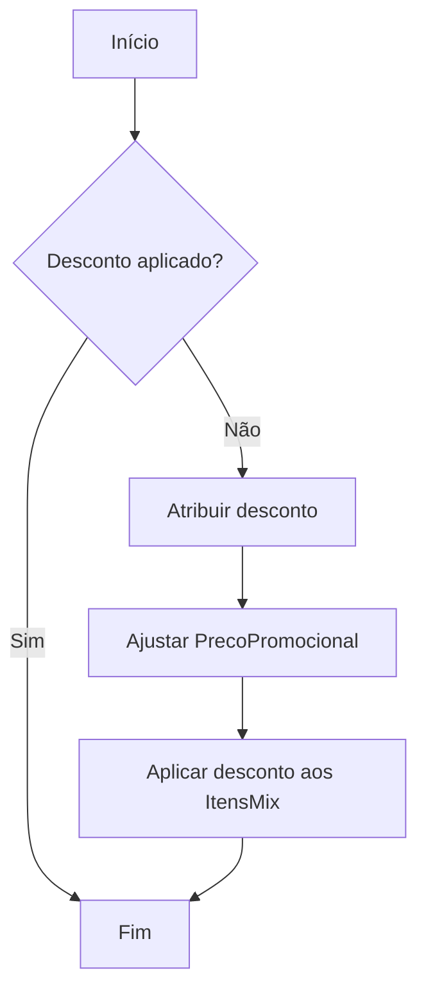
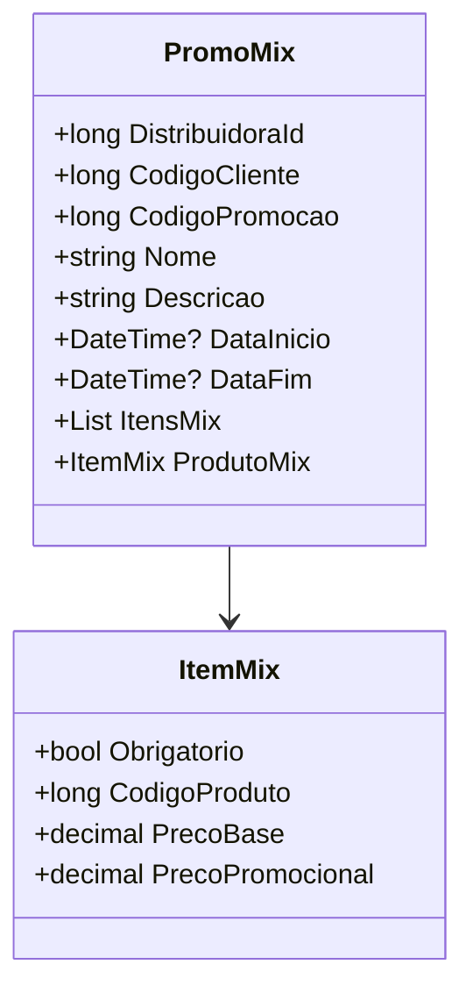

# PromoMix
**Namespace**: IsthmusWinthor.Dominio.POCO.Precos  
**Nome do Arquivo**: PromoMix.cs  

## Visão Geral e Responsabilidade
A classe `PromoMix` representa um modelo de negócio voltado para gerenciar promoções do tipo “mix” de produtos. Ela tem como objetivo garantir que um conjunto de produtos seja adquirido para que a promoção seja ativada. A classe valida se os itens promocionais estão presentes no carrinho de compras do cliente, gerenciando condições específicas e descontos a serem aplicados. Isso é crucial para a integridade do processo de venda e para oferecer incentivos aos clientes com base em suas compras.

## Métodos de Negócio
### Título: `AplicarDescontoProduto` - `public`
- **Objetivo**: Aplica um desconto ao produto misto baseado no preço base do cliente.
- **Comportamento**: 
  1. Calcula o preço base do produto misto subtraindo o percentual de desconto do preço base do cliente.
  2. Ajusta o preço promocional do produto subtraindo o mesmo percentual de desconto aplicado ao preço de venda do cliente.
- **Retorno**: Este método não retorna valor, mas modifica as propriedades de preço do produto misto diretamente.

### Título: `AplicarCondicaoPharmalink` - `public`
- **Objetivo**: Aplica condições de desconto específicas para o contexto Pharmalink a um produto do mix e aos itens associados.
- **Comportamento**:
  1. Se o desconto não foi aplicado previamente, ele atribui o desconto de Pharmalink ao produto mix.
  2. Aplica a mesma lógica a todos os itens do `ItensMix`, garantindo que cada um seja impactado pelo mesmo desconto.
- **Retorno**: Este método não retorna valor, mas modifica os preços promocionais das instâncias de `ProdutoMix` e `ItensMix`.

### Título: `AplicarCondicaoIsthmusIndustria` - `public`
- **Objetivo**: Aplica condições de desconto específicas para o contexto Isthmus Indústria a um produto do mix e aos itens associados.
- **Comportamento**:
  1. Verifica se o desconto já foi aplicado, caso contrário, aplica o desconto de Isthmus à propriedade PrecoPromocional do produto mix.
  2. Itera pelos itens do mix e aplica a condição correspondente.
- **Retorno**: Este método não retorna valor, mas modifica os preços promocionais das instâncias de `ProdutoMix` e `ItensMix`.

### Visualização do método `AplicarCondicaoPharmalink`

### Visualização do método `AplicarCondicaoIsthmusIndustria`

## Propriedades Calculadas e de Validação
### `DescricaoVencimetoPromocao`
- Esta propriedade retorna uma string formatada com a data de término da promoção, se existir. Caso contrário, retorna uma string vazia. É essencial para a visualização da validade da promoção.

### `PossuiProdutoObrigatorio`
- Avalia se há algum item do mix que é obrigatório. Esta propriedade é fundamental para garantir que o cliente esteja ciente dos requisitos para ativar a promoção.

## Navigations Property
- **`ItensMix`**: Lista de itens que devem estar presentes, conforme a condição da promoção. [ItemMix](ItemMix.md)
- **`ProdutoMix`**: Referencia o produto que está sendo promovido. [PrecoProduto](PrecoProduto.md)
- **`TributacaoErp`**: Representa a tributação referente ao produto. [TributacaoErp](TributacaoErp.md)

## Tipos Auxiliares e Dependências
- **Enumerator**: `[TipoPromocaoEnum](TipoPromocaoEnum.md)`
- **Classe de helper**: `[ProdutoDTO](ProdutoDTO.md)`, `[ItemCarrinho](ItemCarrinho.md)`

## Diagrama de Relacionamentos

