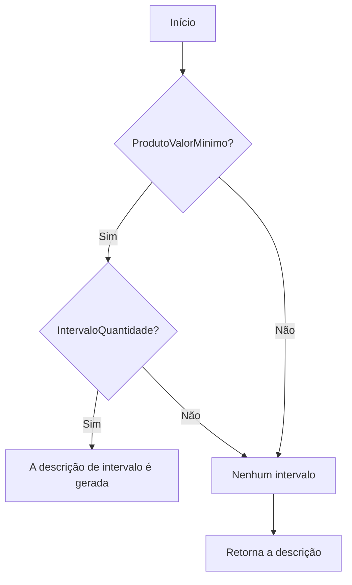
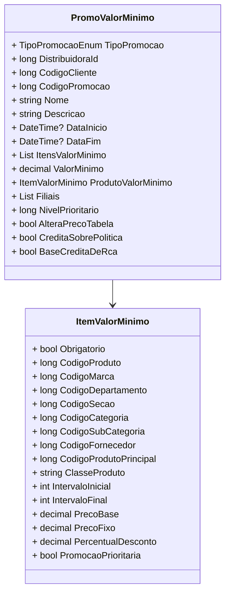

# PromoValorMinimo
**Namespace**: IsthmusWinthor.Dominio.POCO.Precos  
**Nome do Arquivo**: PromoValorMinimo.cs  

## Visão Geral e Responsabilidade
A classe `PromoValorMinimo` representa uma promoção de preço mínimo que deve ser atendida para que um cliente possa usufruir de benefícios relacionados a compras. O problema de negócio que esta classe resolve é a necessidade de definir e validar condições promocionais baseadas em valores mínimos de compra, garantindo que determinados produtos estejam incluídos na transação para a promoção ser válida.

## Métodos de Negócio

### 1. AplicarCondicaoPharmalink
- **Visibilidade**: Public
- **Objetivo**: Aplica condições específicas de desconto para produtos que se encaixam na política Pharmalink.
- **Comportamento**: Este método recebe um desconto e a quantidade de casas decimais. Ele aplica este desconto tanto ao `ProdutoValorMinimo` quanto a todos os itens na lista `ItensValorMinimo`.
- **Retorno**: Não retorna valor; aplica a condição diretamente sobre os objetos.

### 2. AplicarCondicaoIsthmusIndustria
- **Visibilidade**: Public
- **Objetivo**: Aplica condições específicas de desconto para produtos que se encaixam na política da indústria Isthmus.
- **Comportamento**: Este método recebe um valor de desconto e a quantidade de casas decimais. Similar ao método anterior, aplica o desconto ao `ProdutoValorMinimo` e a todos os itens em `ItensValorMinimo`.
- **Retorno**: Não retorna valor; aplica a condição diretamente sobre os objetos.

### 3. DescricaoCondicao
- **Visibilidade**: Private
- **Objetivo**: Cria uma string que descreve as condições da promoção, incluindo valor mínimo e produtos obrigatórios.
- **Comportamento**: Forma um texto com as condições necessárias para a promoção, considerando o valor mínimo e os produtos obrigatórios.
- **Retorno**: Retorna uma string que descreve as condições da promoção.

### 4. DescricaoQuantidade
- **Visibilidade**: Private
- **Objetivo**: Fornece uma descrição da quantidade necessária para a promoção.
- **Comportamento**: Avalia se há um intervalo de quantidades e retorna um texto com os limites de compras.
- **Retorno**: Retorna uma string que descreve a quantidade de produtos.

## Propriedades Calculadas e de Validação
- **DescricaoVencimetoPromocao**: Retorna uma descrição da data de vencimento da promoção, formatando a data de fim, se houver.
  
## Navigations Property
- **ItensValorMinimo**: Lista de [ItemValorMinimo](ItemValorMinimo.md) que define os itens necessários para a promoção ser válida.
- **ProdutoValorMinimo**: Representa o item promocional de valor mínimo, que deve ser um [ItemValorMinimo](ItemValorMinimo.md).

## Tipos Auxiliares e Dependências
- **Enums**:  
  - `[TipoPromocaoEnum](TipoPromocaoEnum.md)`
- **Classes**:  
  - `[TributacaoErp](TributacaoErp.md)`

## Diagrama de Relacionamentos

