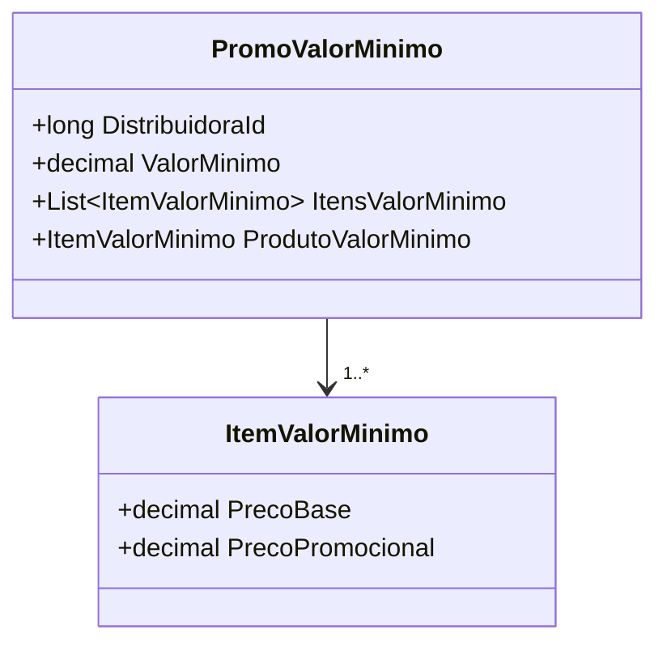

# PromoValorMinimo

**Namespace**: IsthmusWinthor.Dominio.POCO.Precos  
**Nome do Arquivo**: PromoValorMinimo.cs  

## Visão Geral e Responsabilidade
A classe `PromoValorMinimo` representa uma promoção que garante um desconto ao cliente quando um valor mínimo de compra é atingido. O principal problema de negócio resolvido por esta classe é assegurar que para que um cliente se beneficie da promoção, ele deve adquirir um conjunto específico de produtos no valor mínimo estipulado. Além disso, ela controla as condições da promoção, como produtos obrigatórios e regras de tributação.

## Métodos de Negócio

### Título: AplicarCondicaoPharmalink (public)
- **Objetivo**: Este método aplica um desconto específico à condição da promoção, utilizando a taxa de desconto do Pharmalink.
- **Comportamento**:
  1. Recebe um valor de desconto e o número de casas decimais para arredondar.
  2. Aplica o desconto ao `ProdutoValorMinimo` e a todos os `ItensValorMinimo` associados.
- **Retorno**: Este método não retorna um valor, ele apenas aplica uma alteração de estado nos objetos.

### Título: AplicarCondicaoIsthmusIndustria (public)
- **Objetivo**: Este método aplica um desconto específico da indústria à condição da promoção.
- **Comportamento**:
  1. Recebe um valor de desconto e o número de casas decimais para arredondar.
  2. Aplica o desconto ao `ProdutoValorMinimo` e a todos os `ItensValorMinimo` associados.
- **Retorno**: Este método não retorna um valor, ele apenas aplica uma alteração de estado nos objetos.

### Título: DescricaoCondicao (private)
- **Objetivo**: Gera uma descrição textual que detalha as condições da promoção.
- **Comportamento**:
  1. Inicia com uma descrição padrão da promoção.
  2. Adiciona informações sobre o valor mínimo e se existem produtos obrigatórios.
  3. Invoca o método `DescricaoQuantidade` para adicionar informações sobre quantidades.
- **Retorno**: Retorna uma string contendo a descrição detalhada das condições da promoção.

```mermaid
flowchart TD
    A[Início] --> B{Produto Obrigatório}
    B -->|Sim| C[Adiciona "Esse produto é obrigatório para a promoção!"]
    B -->|Não| D{Possui Produtos Obrigatórios}
    D -->|Sim| E[Adiciona "Existem produtos obrigatórios para atingir a promoção!"]
    D -->|Não| F[Continua]
    C --> F
    E --> F
    F --> G[Adiciona informações de quantidade]
    G --> H[Fim]
```

## Propriedades Calculadas e de Validação
- **DescricaoVencimetoPromocao**: 
  - Regra: Esta propriedade calcula e retorna uma string formatada com a data de término da promoção, se disponível. Caso contrário, retorna uma string vazia.

## Navigation Properties
- **ItensValorMinimo**: Um lista de `ItemValorMinimo` que mantém a necessidade de itens específicos para a condição da promoção.  
- **ProdutoValorMinimo**: Representa um produto que é relevante para a promoção, podendo ser obrigatório.

### Links:
- [ItemValorMinimo](ItemValorMinimo.md)

## Tipos Auxiliares e Dependências
- **Enumeradores**: 
  - [TipoPromocaoEnum](TipoPromocaoEnum.md)

## Diagrama de Relacionamentos


---
Gerada em 29/12/2025 21:55:33
