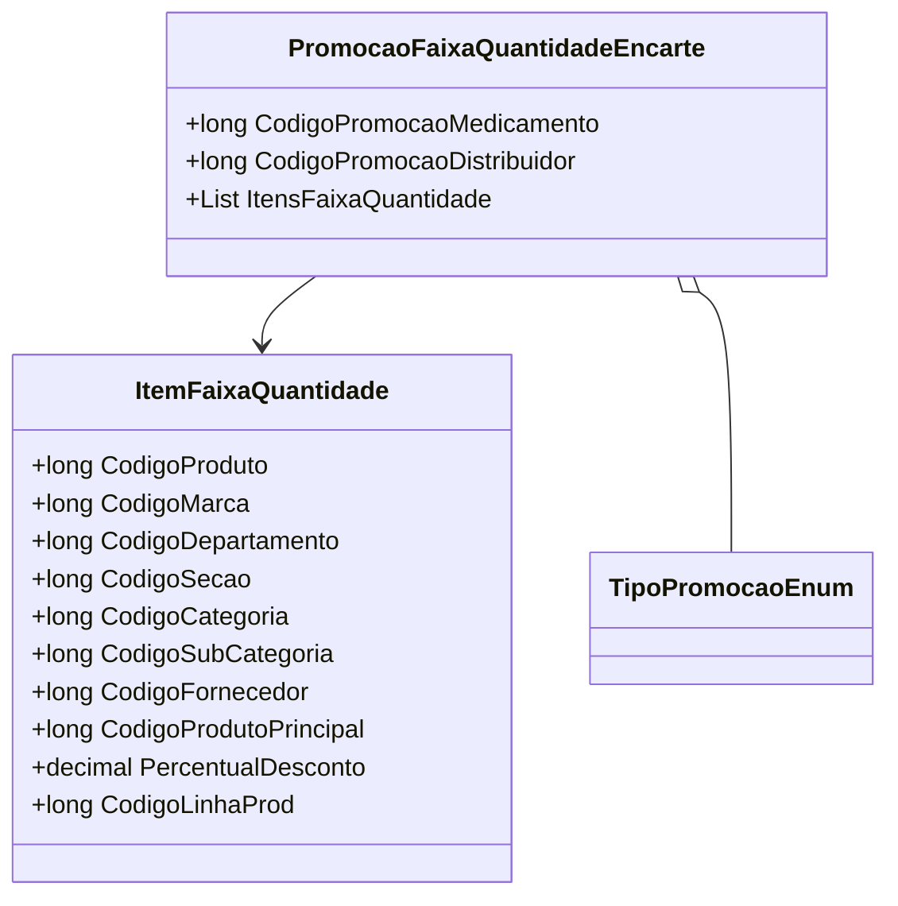

# PromocaoFaixaQuantidadeEncarte
**Namespace**: IsthmusWinthor.Dominio.POCO.Precos  
**Nome do Arquivo**: PromocaoFaixaQuantidadeEncarte.cs  

## Visão Geral e Responsabilidade
A classe `PromocaoFaixaQuantidadeEncarte` é responsável por encapsular a lógica relacionada à promoção de faixa de quantidade de produtos, que permite aplicar descontos com base na quantidade adquirida. Esta classe gerencia os detalhes da promoção e associa itens que fazem parte dessa promoção, garantindo que as regras de negócio relacionadas a descontos e códigos promocionais sejam adequadamente aplicadas.

## Métodos de Negócio

### Título: `CodigoPromocao` (Público)
- **Objetivo**: Garante que o código da promoção retorne o valor correto, priorizando o `CodigoPromocaoMedicamento` quando diferente de zero, caso contrário, retorna o `CodigoPromocaoDistribuidor`.
- **Comportamento**: 
  1. Verifica o valor de `CodigoPromocaoMedicamento`.
  2. Se `CodigoPromocaoMedicamento` é diferente de zero, retorna este valor.
  3. Se `CodigoPromocaoMedicamento` é zero, retorna o valor de `CodigoPromocaoDistribuidor`.
- **Retorno**: Retorna um `long` que representa o código da promoção a ser utilizado, seja do medicamento ou do distribuidor.

## Propriedades Calculadas e de Validação

### Propriedade: `CodigoPromocao`
- **Regra**: A propriedade `CodigoPromocao` calcula seu valor com base na presença de `CodigoPromocaoMedicamento`. Se não estiver configurado, o código do distribuidor é utilizado, garantindo que sempre haja um código válido para a promoção.

## Navigations Property
- **Itens da Promoção**: `ItensFaixaQuantidade` - uma lista de itens que fazem parte da promoção.
- Link Presumido: `[ItemFaixaQuantidade](ItemFaixaQuantidade.md)`

## Tipos Auxiliares e Dependências
- **Enumerador**: 
  - `[TipoPromocaoEnum](TipoPromocaoEnum.md)`

## Diagrama de Relacionamentos

