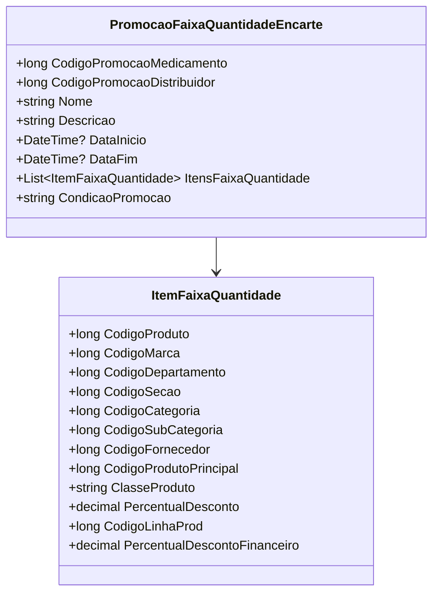

# PromocaoFaixaQuantidadeEncarte
**Namespace**: IsthmusWinthor.Dominio.POCO.Precos  
**Nome do Arquivo**: PromocaoFaixaQuantidadeEncarte.cs  

## Visão Geral e Responsabilidade
`PromocaoFaixaQuantidadeEncarte` representa uma promoção aplicada a faixas de quantidade de produtos, permitindo gerenciar condições específicas de promoção relacionadas a um ou mais itens. Esta classe é fundamental para implementar a lógica de promoções em um sistema de precificação, permitindo ao negócio proporcionar descontos com base na quantidade adquirida pelo cliente. A classe coordena a obtenção dos códigos da promoção e reúne todos os itens aplicáveis a essa faixa promocional.

## Métodos de Negócio
### CódigoPromocao (Propriedade)
- **Objetivo**: Retornar o código da promoção de forma a garantir que, caso exista um código para o medicamento, esse seja priorizado em relação ao código do distribuidor.
- **Comportamento**: Verifica se `CodigoPromocaoMedicamento` é diferente de zero; se sim, retorna este código, caso contrário retorna `CodigoPromocaoDistribuidor`.
- **Retorno**: Retorna um `long` que corresponde ao código da promoção que será utilizado na lógica do sistema.

## Propriedades Calculadas e de Validação
### CódigoPromocao
- **Regra**: O sistema deve sempre preferir o `CodigoPromocaoMedicamento` se ele for válido (diferente de zero). Caso contrário, utilizará o `CodigoPromocaoDistribuidor` como fallback, assegurando a correta aplicação da promoção.

## Navigations Property
- None.

## Tipos Auxiliares e Dependências
- Enum: [TipoPromocaoEnum](TipoPromocaoEnum.md).

## Diagrama de Relacionamentos

---
Gerada em 29/12/2025 21:53:17
