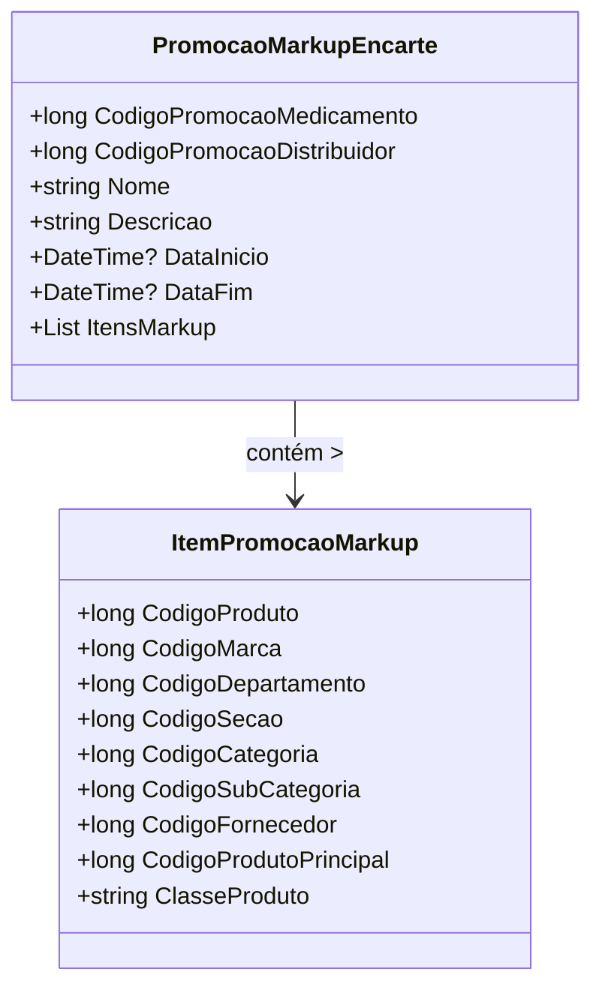

# PromocaoMarkupEncarte
**Namespace**: IsthmusWinthor.Dominio.POCO.Precos  
**Nome do Arquivo**: PromocaoMarkupEncarte.cs  

## Visão Geral e Responsabilidade
A classe `PromocaoMarkupEncarte` representa uma promoção de markup aplicada a um conjunto de itens. Sua principal responsabilidade é garantir que a promoção seja corretamente configurada e que todas as informações necessárias (como códigos de promoção e detalhes de tempo) estejam disponíveis. Ela resolve o problema de negócio de gerenciar promoções de preços em um contexto de venda, permitindo uma integração eficiente entre as promoções de medicamentos e distribuidores.

## Métodos de Negócio

### Código: `CodigoPromocao` (Propriedade)
- **Objetivo**: Garantir a obtenção do código da promoção conforme as regras definidas.
- **Comportamento**: Retorna o `CodigoPromocaoMedicamento` se for maior que zero; caso contrário, retorna o `CodigoPromocaoDistribuidor`.
- **Retorno**: O código da promoção, que pode ser usado para identificar a promoção de forma única.

### Método: `Equals` (override)
- **Objetivo**: Comparar a instância atual com outra para verificar se elas representam a mesma promoção.
- **Comportamento**: Realiza a verificação se o objeto fornecido é do tipo `PromocaoMarkupEncarte` e compara os códigos de promoção.
- **Retorno**: Retorna `true` se os códigos de promoção forem iguais; caso contrário, `false`.

### Método: `GetHashCode` (override)
- **Objetivo**: Fornecer um código hash para a instância baseada em seu código de promoção, útil em estruturas de dados que dependem de hashing.
- **Comportamento**: Gera um código hash usando o `CodigoPromocao`.
- **Retorno**: Retorna um valor inteiro que representa o hash da promoção.

## Propriedades Calculadas e de Validação
- **CodigoPromocao**: Esta propriedade usa a validação condicional para definir qual código de promoção deve ser retornado. Se `CodigoPromocaoMedicamento` for maior que zero, este é retornado, validando a presença de uma promoção válida.

## Navigations Property
- **ItensMarkup**: Esta propriedade é uma lista de `[ItemPromocaoMarkup](ItemPromocaoMarkup.md)`, representando os itens que estão incluídos na promoção de markup.

## Tipos Auxiliares e Dependências
- **TipoPromocaoEnum**: Enumerador que define o tipo de promoção. Referenciado como `[TipoPromocaoEnum](TipoPromocaoEnum.md)`.

## Diagrama de Relacionamentos

Essa documentação fornece uma visão clara e estruturada da classe `PromocaoMarkupEncarte`, suas responsabilidades, regras de negócio e interações com outras classes, facilitando a compreensão e manutenção do código.
