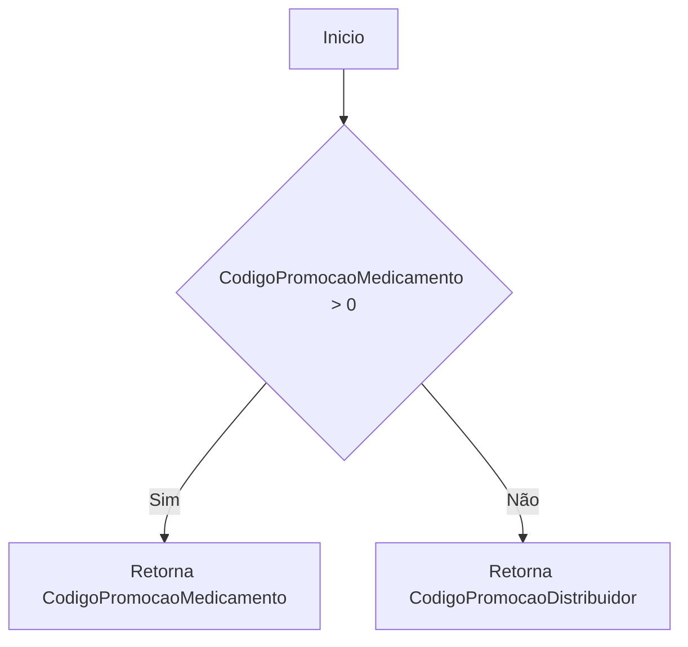
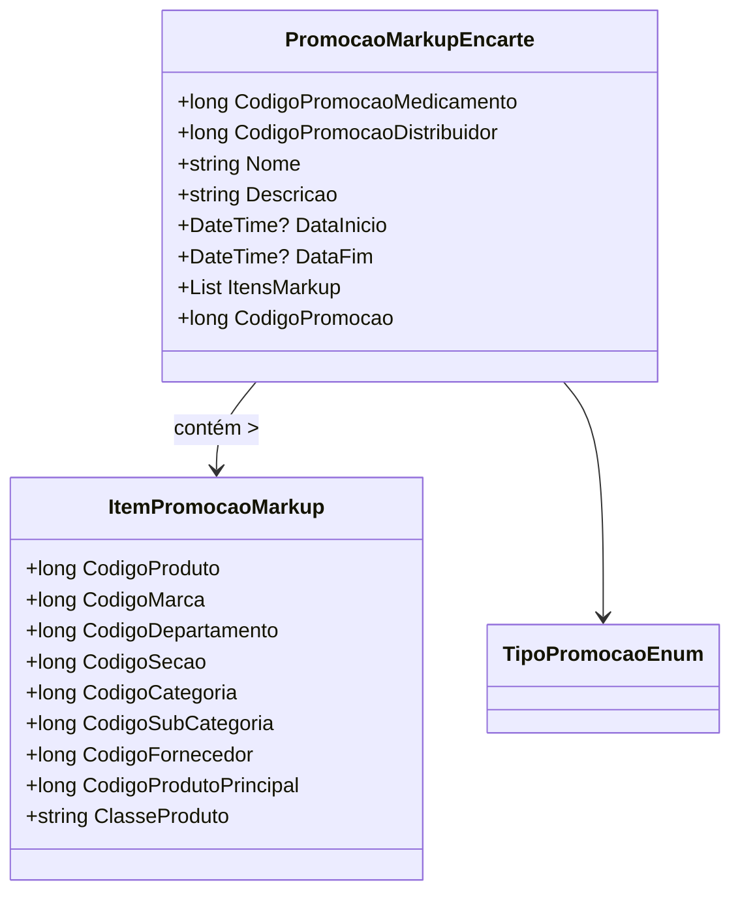

# PromocaoMarkupEncarte
**Namespace**: IsthmusWinthor.Dominio.POCO.Precos  
**Nome do Arquivo**: PromocaoMarkupEncarte.cs  

## Visão Geral e Responsabilidade
A classe `PromocaoMarkupEncarte` representa uma promoção do tipo "markup", englobando detalhes sobre a promoção e uma lista de itens associados a esta promoção. Essa classe é responsável por gerenciar as regras de negócio relacionadas ao cálculo de preços promocionais, garantindo que o código de promoção correto (seja do medicamento ou do distribuidor) seja aplicado, e que a promoção tenha um intervalo de validade com início e fim definidos.

## Métodos de Negócio

### Título: `CodigoPromocao` (Público)
- **Objetivo**: Garante que o código de promoção retornado seja o válido, priorizando o código do medicamento se estiver definido, e utilizando o código do distribuidor caso contrário.
- **Comportamento**:
  1. Checa se o `CodigoPromocaoMedicamento` é maior que zero.
  2. Se for, retorna este valor.
  3. Se não, retorna o `CodigoPromocaoDistribuidor`.
- **Retorno**: Retorna o código de promoção correto, que pode ser utilizado para identificar a promoção aplicada.

## Propriedades Calculadas e de Validação
- `CodigoPromocao`: Propriedade que retorna o código de promoção correto com base nas regras de prioridade entre `CodigoPromocaoMedicamento` e `CodigoPromocaoDistribuidor`.

## Navigations Property
- `ItensMarkup`: Lista de itens da promoção, que é uma coleção de objetos da classe `ItemPromocaoMarkup`: [ItemPromocaoMarkup](ItemPromocaoMarkup.md).

## Tipos Auxiliares e Dependências
- **Enumeradores**:  
  - [TipoPromocaoEnum](TipoPromocaoEnum.md)

## Diagrama de Relacionamentos

Essa documentação fornece uma visão clara sobre a classe `PromocaoMarkupEncarte`, suas responsabilidades, métodos de negócio relevantes, propriedades e as entidades que ela relaciona.
---
Gerada em 29/12/2025 21:53:32
