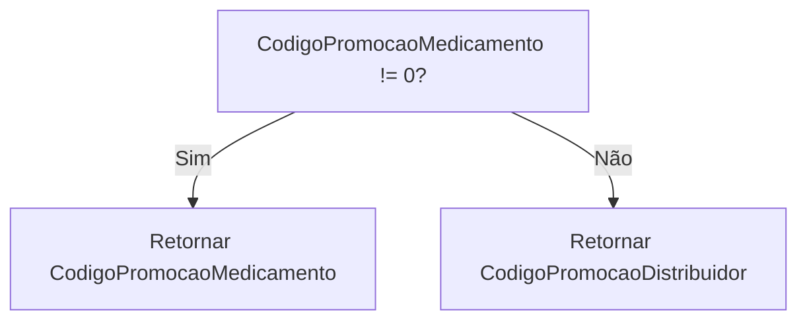
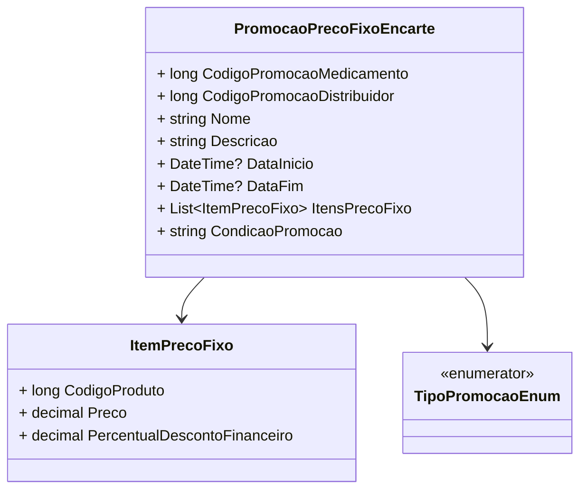

# PromocaoPrecoFixoEncarte
**Namespace**: IsthmusWinthor.Dominio.POCO.Precos  
**Nome do Arquivo**: PromocaoPrecoFixoEncarte.cs  

## Visão Geral e Responsabilidade
A classe `PromocaoPrecoFixoEncarte` representa uma promoção de preço fixo aplicada a produtos, sendo capaz de definir um código de promoção baseado em uma lógica específica. Ela resolve o problema de aplicação de descontos de maneira flexível, considerando tanto o código de promoção do medicamento quanto o do distribuidor, proporcionando uma visão clara e unificada das promoções disponíveis.

## Métodos de Negócio

### Título: `CodigoPromocao` - `public`
- **Objetivo**: Garante que um código de promoção válido seja retornado, priorizando o código do medicamento quando este está disponível.
- **Comportamento**: 
  1. Verifica se `CodigoPromocaoMedicamento` é diferente de zero.
  2. Se verdadeiro, retorna `CodigoPromocaoMedicamento`.
  3. Se falso, retorna `CodigoPromocaoDistribuidor`.
- **Retorno**: Retorna o código de promoção que será utilizado para identificar a promoção aplicada.

## Propriedades Calculadas e de Validação
- `CodigoPromocao`: Este é uma propriedade calculada que determina o código de promoção a ser usado com base na presença de um código promocional específico do medicamento. A regra é que, se o código do medicamento for diferente de zero, ele será utilizado; caso contrário, o código do distribuidor é retornado.

## Navigations Property
- `ItensPrecoFixo`: Esta propriedade representa uma lista de itens que possuem preço fixo dentro da promoção. O arquivo presumido para esta classe é `[ItemPrecoFixo](ItemPrecoFixo.md)`.

## Tipos Auxiliares e Dependências
- `TipoPromocaoEnum`: Este enum é utilizado para definir o tipo da promoção. O arquivo presumido para ele é `[TipoPromocaoEnum](TipoPromocaoEnum.md)`.

## Diagrama de Relacionamentos

