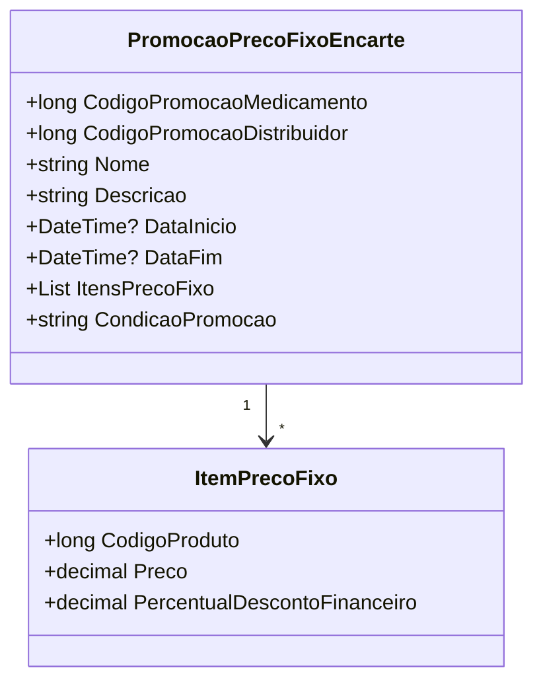

# PromocaoPrecoFixoEncarte
- **Namespace**: IsthmusWinthor.Dominio.POCO.Precos
- **Nome do Arquivo**: PromocaoPrecoFixoEncarte.cs

## Visão Geral e Responsabilidade
A classe `PromocaoPrecoFixoEncarte` atua como um modelo de domínio que encapsula as regras de negócio relacionadas a uma promoção de preço fixo para medicamentos. Seu objetivo principal é gerenciar as promoções e garantir que um código promocional válido seja utilizado, permitindo a aplicação de preços fixos e descontos respectivos, aplicando a lógica de seleção do código promocional.

## Métodos de Negócio

### Título: CodigoPromocao (Propriedade)
- **Objetivo**: Garante que sempre será retornado um código promocional válido. Se `CodigoPromocaoMedicamento` estiver disponível e diferente de zero, ele é utilizado; caso contrário, `CodigoPromocaoDistribuidor` é retornado.
- **Comportamento**: 
  1. Verifica se `CodigoPromocaoMedicamento` é diferente de zero.
  2. Se verdadeiro, retorna `CodigoPromocaoMedicamento`.
  3. Se falso, retorna `CodigoPromocaoDistribuidor`.
- **Retorno**: O valor retornado é o código promocional a ser aplicado; assegura que um código válido esteja sempre disponível.

## Propriedades Calculadas e de Validação
- **CodigoPromocao**: A propriedade contém lógica que determina qual código promocional é retornado com base na condição das propriedades `CodigoPromocaoMedicamento` e `CodigoPromocaoDistribuidor`.

## Navigations Property
- **ItensPrecoFixo**: Lista de itens associados a promoção de preço fixo, que é uma coleção do tipo [ItemPrecoFixo](ItemPrecoFixo.md).

## Tipos Auxiliares e Dependências
- `TipoPromocaoEnum`: [TipoPromocaoEnum](TipoPromocaoEnum.md)
- `ItemPrecoFixo`: [ItemPrecoFixo](ItemPrecoFixo.md)

## Diagrama de Relacionamentos

---
Gerada em 29/12/2025 21:53:45
