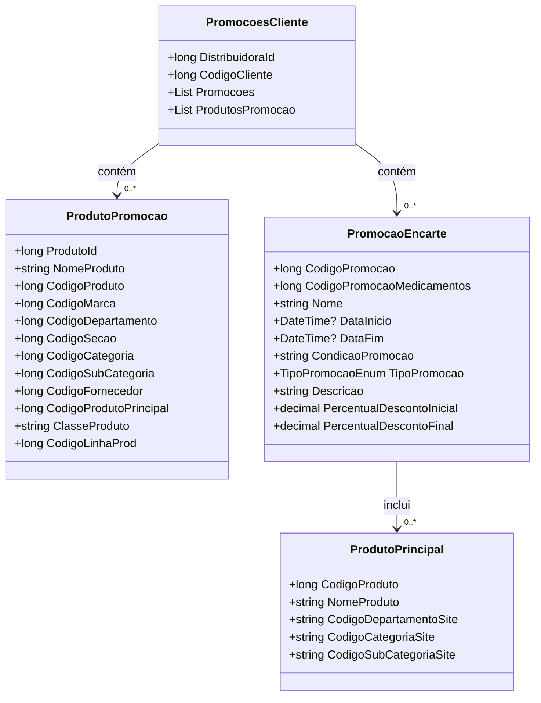

# PromocoesCliente
**Namespace**: IsthmusWinthor.Dominio.POCO.Precos  
**Nome do Arquivo**: PromocoesCliente.cs  

## Visão Geral e Responsabilidade
A classe `PromocoesCliente` representa as promoções associadas a um cliente em uma distribuidora. Ela rastreia as promoções aplicáveis ​​aos produtos comprados pelo cliente e à relação do cliente com a distribuidora, facilitando a gestão e aplicação de ofertas personalizadas.

## Métodos de Negócio
Esta classe não possui métodos de negócio com lógica complexa. Portanto, não há métodos a serem detalhados nesta seção.

## Propriedades Calculadas e de Validação
Esta classe não apresenta propriedades com lógica no `get` ou validação no `set`. Todas as propriedades são anêmicas e servem, principalmente, para transportar dados.

## Navigations Property
- `PromocaoEncarte`: [PromocaoEncarte](PromocaoEncarte.md)
- `ProdutoPromocao`: [ProdutoPromocao](ProdutoPromocao.md)

## Tipos Auxiliares e Dependências
- Enumerador: [TipoPromocaoEnum](TipoPromocaoEnum.md)

---

# ProdutoPromocao
**Namespace**: IsthmusWinthor.Dominio.POCO.Precos  
**Nome do Arquivo**: ProdutoPromocao.cs  

## Visão Geral e Responsabilidade
A classe `ProdutoPromocao` representa informações detalhadas de um produto que participa de uma promoção. Ela encapsula dados relevantes ao produto e a lógica de igualdade, ajudando a garantir a integridade e singularidade dos produtos em promoções.

## Métodos de Negócio
### Título: Equals (public override)
- **Objetivo**: Garante que dois objetos `ProdutoPromocao` sejam considerados iguais se todos os seus atributos relevantes forem iguais.
- **Comportamento**:
  1. Verifica se o objeto comparado é uma instância de `ProdutoPromocao`.
  2. Compara cada propriedade relevante (`ProdutoId`, `NomeProduto`, `CodigoProduto`, etc.).
  3. Retorna `true` se todas as propriedades corresponderem, caso contrário, retorna `false`.
- **Retorno**: Um valor booleano indicando se os dois objetos são iguais ou não.

### Título: GetHashCode (public override)
- **Objetivo**: Garante que o objeto possa ser usado como chave em coleções hash, gerando um código hash válido baseado em seus atributos.
- **Comportamento**:
  1. Cria um novo objeto `HashCode`.
  2. Adiciona cada propriedade relevante ao hash.
  3. Retorna o código hash resultante.
- **Retorno**: Um inteiro representando o código hash do objeto.

## Propriedades Calculadas e de Validação
Esta classe não possui propriedades com lógica complexa em seu `get` ou `set`. As propriedades servem para armazenar informações puramente de dados.

## Navigations Property
Esta classe não possui propriedades que são classes complexas do domínio.

## Tipos Auxiliares e Dependências
Esta classe não depende de tipos auxiliares ou enumeradores.

---

# PromocaoEncarte
**Namespace**: IsthmusWinthor.Dominio.POCO.Precos  
**Nome do Arquivo**: PromocaoEncarte.cs  

## Visão Geral e Responsabilidade
A classe `PromocaoEncarte` representa uma promoção específica e suas características associadas, incluindo o tipo de promoção, as datas de início e fim, e o desconto aplicável. O objetivo é fornecer uma estrutura para a gestão e visualização das promoções oferecidas.

## Métodos de Negócio
### Título: Equals (public override)
- **Objetivo**: Garante que duas instâncias de `PromocaoEncarte` sejam consideradas iguais se os códigos de promoção e tipo de promoção forem idênticos.
- **Comportamento**:
  1. Verifica se o objeto comparado é uma instância de `PromocaoEncarte`.
  2. Compara `CodigoPromocao` e `TipoPromocao`.
  3. Retorna `true` se ambos forem iguais, caso contrário, retorna `false`.
- **Retorno**: Um valor booleano indicando igualdade entre os dois objetos.

### Título: GetHashCode (public override)
- **Objetivo**: Garante um código hash único para instâncias de `PromocaoEncarte`.
- **Comportamento**:
  1. Combina `CodigoPromocao` e `TipoPromocao` para gerar o código hash.
  2. Retorna o código hash resultante.
- **Retorno**: Um inteiro representando o código hash do objeto.

## Propriedades Calculadas e de Validação
### Título: DescricaoDescontoPromocao (public string)
- **Objetivo**: Gera uma descrição do desconto aplicado com base nos percentuais de desconto.
- **Comportamento**:
  1. Verifica se `PercentualDescontoInicial` e `PercentualDescontoFinal` são ambos menores ou iguais a 0; caso sim, retorna uma string vazia.
  2. Se os percentuais forem diferentes, retorna uma cadeia de texto formatada informando o desconto máximo.
  3. Se os percentuais forem iguais, retorna a porcentagem única informando o desconto.
- **Retorno**: Uma string que descreve a promoção.

## Navigations Property
- `ProdutoPrincipal`: [ProdutoPrincipal](ProdutoPrincipal.md)

## Tipos Auxiliares e Dependências
- Enumerador: [TipoPromocaoEnum](TipoPromocaoEnum.md)

---

# ProdutoPrincipal
**Namespace**: IsthmusWinthor.Dominio.POCO.Precos  
**Nome do Arquivo**: ProdutoPrincipal.cs  

## Visão Geral e Responsabilidade
A classe `ProdutoPrincipal` representa um produto que é central em uma promoção, contendo informações específicas sobre o produto que podem ser relevantes para a exibição ou nesta promoção.

## Métodos de Negócio
Esta classe não possui métodos de negócio com lógica complexa.

## Propriedades Calculadas e de Validação
Não há propriedades com lógica no `get` ou validação no `set`, pois a classe é predominantemente de transporte de dados.

## Navigations Property
Esta classe não possui propriedades que são classes complexas do domínio.

## Tipos Auxiliares e Dependências
Esta classe não depende de tipos auxiliares ou enumeradores.

---

## Diagrama de Relacionamentos

