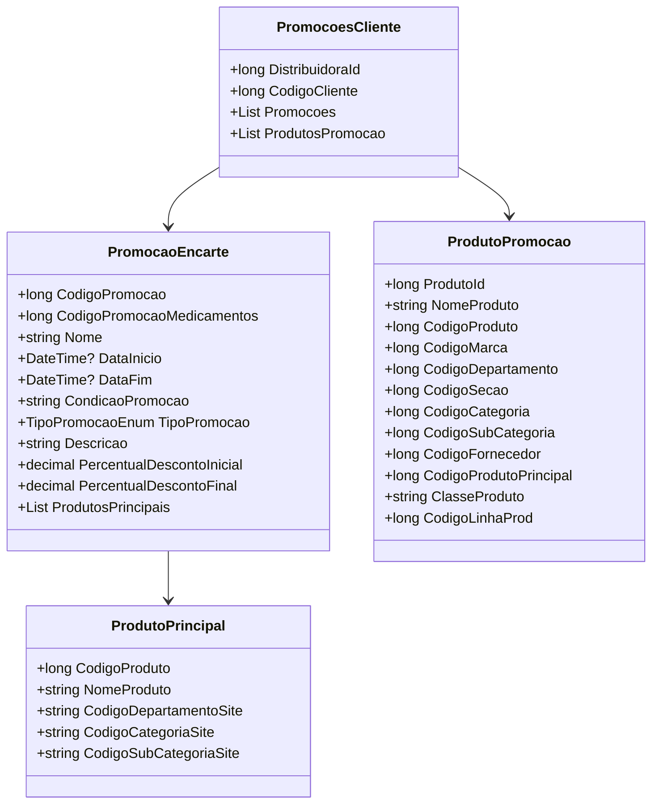

# PromocoesCliente
**Namespace**: IsthmusWinthor.Dominio.POCO.Precos  
**Nome do Arquivo**: PromocoesCliente.cs  

## Visão Geral e Responsabilidade
A classe `PromocoesCliente` representa a associação entre um cliente e suas promoções ativadas por uma distribuidora. Ela é responsável por gerenciar as promoções aplicáveis a um cliente específico, possibilitando a visualização e manipulação de tais dados dentro do sistema, contribuindo para a implementação de estratégias de marketing e promoções direcionadas.

## Métodos de Negócio
Não há métodos com lógica complexa na classe `PromocoesCliente`.

## Propriedades Calculadas e de Validação
Não existem propriedades calculadas ou de validação na classe `PromocoesCliente`.

## Navigations Property
- `List<PromocaoEncarte> Promocoes`: [PromocaoEncarte](PromocaoEncarte.md)
- `List<ProdutoPromocao> ProdutosPromocao`: [ProdutoPromocao](ProdutoPromocao.md)

## Tipos Auxiliares e Dependências
- **Enumeradores**:
  - [TipoPromocaoEnum](TipoPromocaoEnum.md)

---

# ProdutoPromocao
**Namespace**: IsthmusWinthor.Dominio.POCO.Precos  
**Nome do Arquivo**: ProdutoPromocao.cs  

## Visão Geral e Responsabilidade
A classe `ProdutoPromocao` encapsula as características e identificações de produtos que estão em promoção. Sua responsabilidade é garantir que todas as informações relevantes de um produto durante uma promoção sejam armazenadas corretamente e possam ser utilizadas para avaliação de ofertas e gestão de estoques.

## Métodos de Negócio
Não há métodos com lógica complexa na classe `ProdutoPromocao`.

## Propriedades Calculadas e de Validação
Não existem propriedades calculadas ou de validação na classe `ProdutoPromocao`.

## Navigations Property
Não existem propriedades de navegação complexas na classe `ProdutoPromocao`.

## Tipos Auxiliares e Dependências
Nenhum tipo auxiliar ou dependência é utilizado diretamente na classe `ProdutoPromocao`.

---

# PromocaoEncarte
**Namespace**: IsthmusWinthor.Dominio.POCO.Precos  
**Nome do Arquivo**: PromocaoEncarte.cs  

## Visão Geral e Responsabilidade
A classe `PromocaoEncarte` representa as promoções específicas que podem ser associadas aos produtos, contendo informações sobre a condição e o tipo da promoção. Ela é responsável por controlar e descrever as ofertas a serem apresentadas ao cliente, considerando a lógica de descontos que podem variar ao longo do tempo.

## Métodos de Negócio
Não há métodos com lógica complexa na classe `PromocaoEncarte`.

## Propriedades Calculadas e de Validação
### `DescricaoDescontoPromocao`
- **Objetivo**: Fornecer uma descrição formatada do desconto disponível para a promoção.
- **Comportamento**: A lógica verifica se os percentuais de desconto são válidos (maiores que zero). Se ambos forem zero, retorna uma string vazia. Se os percentuais forem diferentes, retorna uma descrição que inclui o percentual final; caso contrário, retorna uma descrição com o percentual único.
- **Retorno**: Descrição do desconto aplicável.

```mermaid
flowchart TD
    A[Percentuais de Desconto] -->|Percentual Inicial <= 0 e Percentual Final <= 0| B[Retorna ""]
    A -->|Percentual Inicial != Percentual Final| C[Retorna "Até {PercentualDescontoFinal} % OFF"]
    A -->|Caso Contrário| D[Retorna "{PercentualDescontoFinal} % OFF"]
```

## Navigations Property
- `List<ProdutoPrincipal> ProdutosPrincipais`: [ProdutoPrincipal](ProdutoPrincipal.md)

## Tipos Auxiliares e Dependências
- **Enumeradores**:
  - [TipoPromocaoEnum](TipoPromocaoEnum.md)

---

# ProdutoPrincipal
**Namespace**: IsthmusWinthor.Dominio.POCO.Precos  
**Nome do Arquivo**: ProdutoPrincipal.cs  

## Visão Geral e Responsabilidade
A classe `ProdutoPrincipal` agrupa informações de identificação de produtos que se destacam nas promoções. Seu papel é fornecer dados como nome e códigos que são usados para associar produtos em campanhas promocionais, permitindo uma melhor organização e apresentação dos produtos ao cliente.

## Métodos de Negócio
Não há métodos com lógica complexa na classe `ProdutoPrincipal`.

## Propriedades Calculadas e de Validação
Não existem propriedades calculadas ou de validação na classe `ProdutoPrincipal`.

## Navigations Property
Não existem propriedades de navegação complexas na classe `ProdutoPrincipal`.

## Tipos Auxiliares e Dependências
Nenhum tipo auxiliar ou dependência é utilizado diretamente na classe `ProdutoPrincipal`.

---

## Diagrama de Relacionamentos

---
Gerada em 29/12/2025 21:54:10
