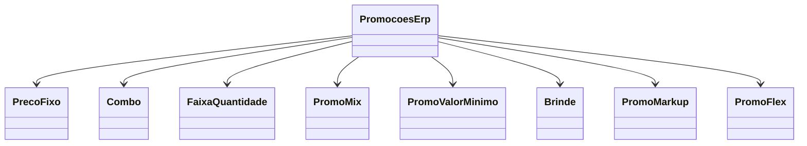

# PromocoesErp
**Namespace**: IsthmusWinthor.Dominio.POCO.Precos  
**Nome do Arquivo**: PromocoesErp.cs  

## Visão Geral e Responsabilidade
A classe `PromocoesErp` atua como um agregado que gerencia diferentes tipos de promoções e preços fixos no sistema. Ela permite a organização e a manipulação de diversas estratégias promocionais, assegurando a integridade dos dados relacionados à precificação e oferta de brindes. A problemática que esta classe resolve é a necessidade de gerenciar de forma eficiente várias promoções e políticas de preço para acomodar as dinâmicas do mercado e das vendas.

## Métodos de Negócio
Não há métodos específicos com lógica de negócio implementada nesta classe.

## Propriedades Calculadas e de Validação
Não existem propriedades com lógica de 'get' ou validação de 'set' nesta classe.

## Navigation Property
- [PrecoFixo](PrecoFixo.md)
- [Combo](Combo.md)
- [FaixaQuantidade](FaixaQuantidade.md)
- [PromoMix](PromoMix.md)
- [PromoValorMinimo](PromoValorMinimo.md)
- [Brinde](Brinde.md)
- [PromoMarkup](PromoMarkup.md)
- [PromoFlex](PromoFlex.md)

## Tipos Auxiliares e Dependências
Não há enumeradores ou classes estáticas/helpers utilizados diretamente nesta classe.

## Diagrama de Relacionamentos

---
Gerada em 29/12/2025 21:54:20
