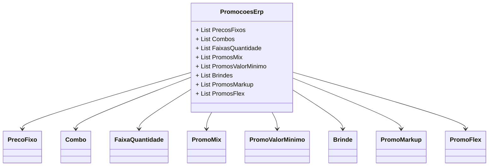

# PromocoesErp
**Namespace**: IsthmusWinthor.Dominio.POCO.Precos  
**Nome do Arquivo**: PromocoesErp.cs  

## Visão Geral e Responsabilidade
A classe `PromocoesErp` atua como uma raiz de agregado para gerenciar diversas promoções dentro de um sistema de preços corporativo. Ela encapsula diferentes tipos de promoções, como preços fixos, combos, faixas de quantidade e promoções de mix, permitindo a implementação e manipulação coerente das regras de negócio associadas às promoções de vendas. Isso garante que as promoções sejam configuradas e acessadas de maneira organizada, facilitando a gestão de preços e ofertas para os produtos.

## Propriedades
A classe contém as seguintes propriedades que mantêm associações com outras classes do domínio:
- `List<PrecoFixo> PrecosFixos`: Representa os preços fixos aplicáveis.
- `List<Combo> Combos`: Contém informações sobre combos de produtos.
- `List<FaixaQuantidade> FaixasQuantidade`: Define faixas de quantidade para a aplicação de promoções.
- `List<PromoMix> PromosMix`: Representa promoções de mix de produtos.
- `List<PromoValorMinimo> PromosValorMinimo`: Gerencia as promoções com base em valores mínimos de compras.
- `List<Brinde> Brindes`: Contém informações sobre brindes oferecidos juntamente com as promoções.
- `List<PromoMarkup> PromosMarkup`: Abarca promoções relacionadas a markups.
- `List<PromoFlex> PromosFlex`: Trata promoções flexíveis com regras específicas.

## Navigations Property
- `[PrecoFixo](PrecoFixo.md)`
- `[Combo](Combo.md)`
- `[FaixaQuantidade](FaixaQuantidade.md)`
- `[PromoMix](PromoMix.md)`
- `[PromoValorMinimo](PromoValorMinimo.md)`
- `[Brinde](Brinde.md)`
- `[PromoMarkup](PromoMarkup.md)`
- `[PromoFlex](PromoFlex.md)`

## Tipos Auxiliares e Dependências
- `PrecoFixo`
- `Combo`
- `FaixaQuantidade`
- `PromoMix`
- `PromoValorMinimo`
- `Brinde`
- `PromoMarkup`
- `PromoFlex`

## Diagrama de Relacionamentos

