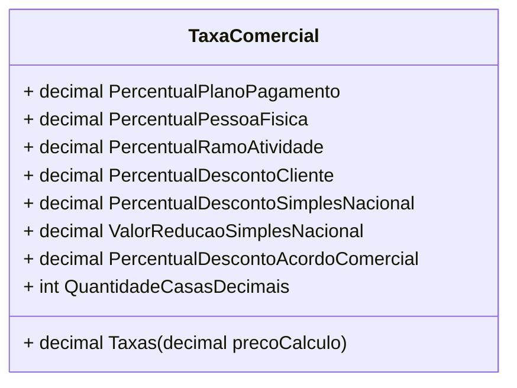

# TaxaComercial

- **Namespace**: IsthmusWinthor.Dominio.POCO.Precos
- **Nome do Arquivo**: TaxaComercial.cs

## Visão Geral e Responsabilidade
A classe `TaxaComercial` desempenha um papel fundamental no cálculo de taxas comerciais aplicáveis a produtos ou serviços. Ela resolve o problema de negócios relacionado à aplicação correta de descontos e taxas a partir de diferentes cenários, como plano de pagamento, tipo de cliente e ramo de atividade. Essa classe encapsula a lógica necessária para calcular a quantidade total de taxas a serem aplicadas, garantido a precisão fiscal e a conformidade nas propostas de preços.

## Métodos de Negócio

### `Taxas(decimal precoCalculo)`
- **Visibilidade**: público
- **Objetivo**: Este método garante que todas as taxas e descontos relevantes sejam aplicados ao preço de acordo com as variáveis configuradas.
- **Comportamento**: 
  1. Inicializa a variável `taxas` com zero.
  2. Se `precoCalculo` for menor ou igual a zero, retorna zero imediatamente.
  3. Calcule e some a taxa do plano de pagamento ao total de taxas.
  4. Calcule e some a taxa de pessoa física (com validações necessárias, mas não implementadas no método).
  5. Calcule e some a taxa do ramo de atividade.
  6. Calcule e aplique a taxa de desconto do Simples Nacional conforme a regra de cálculo.
  7. Calcule e aplique a taxa de desconto do acordo comercial.
  8. Calcule e aplique a taxa de desconto do cliente, utilizando as regras de aumento e desconto.
  9. Retorna o valor total de taxas calculadas.

```mermaid
flowchart TD
    A[Preço Cálculo <= 0] -->|Sim| B[Retornar 0]
    A -->|Não| C[Calcular Taxa Plano de Pagamento]
    C --> D[Calcular Taxa Pessoa Física]
    D --> E[Calcular Taxa Ramo de Atividade]
    E --> F[Calcular (-)Taxa Simples Nacional]
    F --> G[Calcular (-)Taxa Acordo Comercial]
    G --> H[Calcular (-)Taxa Cliente]
    H --> I[Retornar Taxas]
```

## Propriedades Calculadas e de Validação
- **QuantidadeCasasDecimais**: Define a quantidade de casas decimais a serem utilizadas nos cálculos de taxas, assegurando a precisão no retorno dos valores monetários.

## Navigation Property
- Nenhuma propriedade de navegação complexa definida.

## Tipos Auxiliares e Dependências
- Enumerações e Classes estáticas não identificadas diretamente, mas recomenda-se a criação de enums para tipos de clientes ou planos, se aplicáveis.

## Diagrama de Relacionamentos


Essa documentação fornece uma visão clara e direta sobre a lógica e as regras de negócios que a classe `TaxaComercial` implementa, permitindo que desenvolvedores e stakeholders compreendam seu funcionamento e seus impactos nas operações de cálculo de preço.
