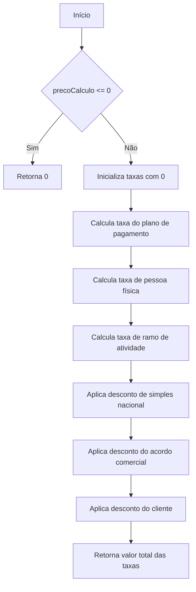
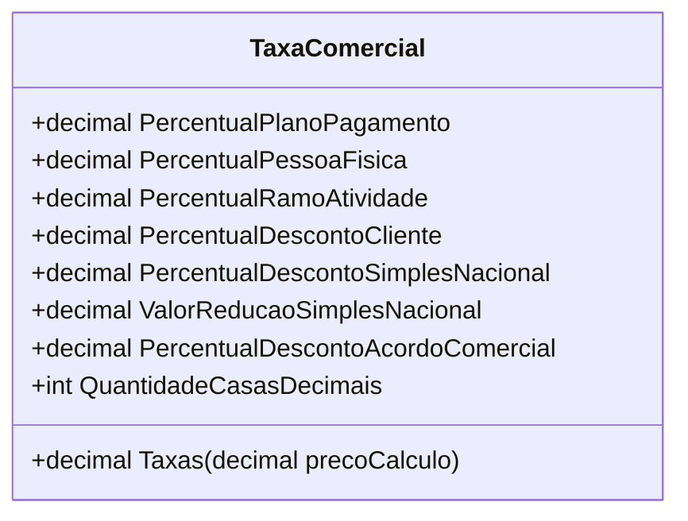

# TaxaComercial
**Namespace**: IsthmusWinthor.Dominio.POCO.Precos  
**Nome do Arquivo**: TaxaComercial.cs  

## Visão Geral e Responsabilidade
A classe `TaxaComercial` é responsável por calcular as taxas comerciais aplicáveis a um preço fornecido, levando em consideração diferentes percentuais que podem variar conforme o plano de pagamento, tipo de pessoa (física ou jurídica), ramo de atividade, além de descontos específicos. Essa classe endereça o problema de calcular o preço final de um produto de forma dinâmica, considerando múltiplos critérios que impactam o valor a ser cobrado.

## Métodos de Negócio

### Método: Taxas (public)
- **Objetivo**: Calcular a soma total de taxas que devem ser aplicadas a um preço base fornecido.
- **Comportamento**: 
  1. Inicializa a variável `taxas` com 0.
  2. Verifica se o `precoCalculo` é menor ou igual a zero e retorna 0 caso seja.
  3. Calcula a taxa do plano de pagamento e soma ao total de taxas.
  4. Adiciona a taxa para pessoas físicas, considerando a lógica de validação de cliente.
  5. Calcula a taxa de ramo de atividade e adiciona ao total.
  6. Aplica o desconto de simples nacional como uma taxa ou desconto dependendo do seu valor.
  7. Aplica desconto ou taxa referente ao acordo comercial.
  8. Por fim, aplica desconto ou taxa referente ao cliente, dependendo do seu percentual.
- **Retorno**: O valor total das taxas aplicadas ao preço, que pode ser positivo (acréscimos) ou negativo (descontos).

## Propriedades Calculadas e de Validação
Neste caso, não há propriedades que possuam cálculos complexos ou validações em suas definições diretamente, servindo apenas como armazenadores de dados.

## Navigations Property
Não há propriedades de navegação no modelo presente.

## Tipos Auxiliares e Dependências
Esta classe não utiliza enumeradores ou classes estáticas/helpers externas. 

## Diagrama de Relacionamentos

---
Gerada em 29/12/2025 21:55:48
