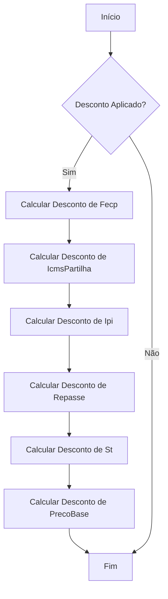
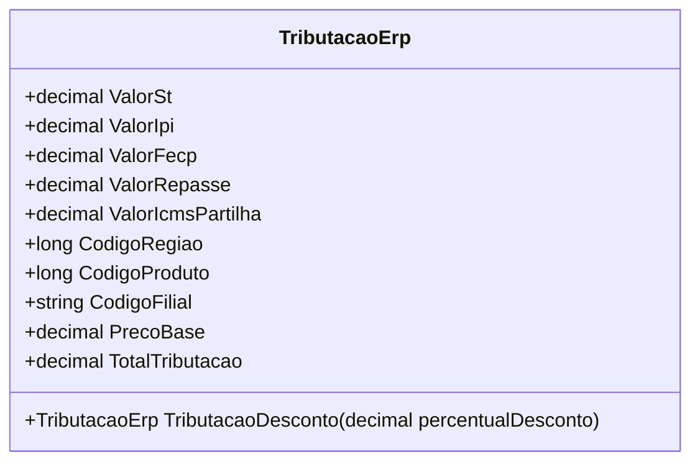

# TributacaoErp
**Namespace**: IsthmusWinthor.Dominio.POCO.Precos  
**Nome do Arquivo**: TributacaoErp.cs  

## Visão Geral e Responsabilidade
A classe `TributacaoErp` é responsável por encapsular a lógica de cálculo e manipulação das diversas tributações associadas a um produto. Ela aborda o problema de negócio relativo à aplicação de impostos de diferentes naturezas, como ICMS, IPI, e outros, facilitando a gestão fiscal e a compatibilidade com sistemas de gestão empresarial. A classe também possibilita o ajuste automático dos valores tributários em situações específicas, como promoções.

## Métodos de Negócio

### Título: TributacaoDesconto (public)
- **Objetivo:** Este método aplica um desconto percentual a cada tipo de tributo, ajustando os valores de tributação em conformidade com a nova condição de preço base.
- **Comportamento:**
  1. O método inicia a criação de uma nova instância de `TributacaoErp`.
  2. Os códigos de produto e região são copiados da instância atual.
  3. Para cada tipo de tributação (ValorFecp, ValorIcmsPartilha, ValorIpi, ValorRepasse, ValorSt), o desconto percentual é aplicado, diminuindo o valor apropriado.
  4. O preço base também é ajustado conforme o percentual de desconto aplicado.
  5. Por fim, a nova instância com os valores ajustados é retornada.
- **Retorno:** Retorna uma nova instância de `TributacaoErp` com todos os valores de tributação e o preço base ajustados pelo percentual de desconto.

## Propriedades Calculadas e de Validação
- `TotalTributacao`: Calcula o total de tributos somando `ValorSt`, `ValorIpi`, `ValorFecp`, `ValorRepasse` e `ValorIcmsPartilha`. Este total é crucial para relatórios fiscais e análises financeiras, garantindo que todos os impostos aplicados a um produto sejam considerados de maneira adequada.

## Navigations Property
- Nenhuma propriedade complexa de navegação foi identificada nesta classe.

## Tipos Auxiliares e Dependências
- Nenhum enumerador ou classe auxiliar foi utilizado diretamente em `TributacaoErp`.

## Diagrama de Relacionamentos

---
Gerada em 29/12/2025 21:56:01
