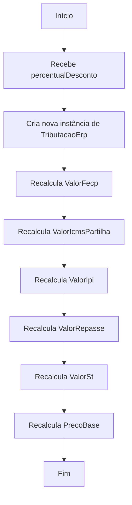
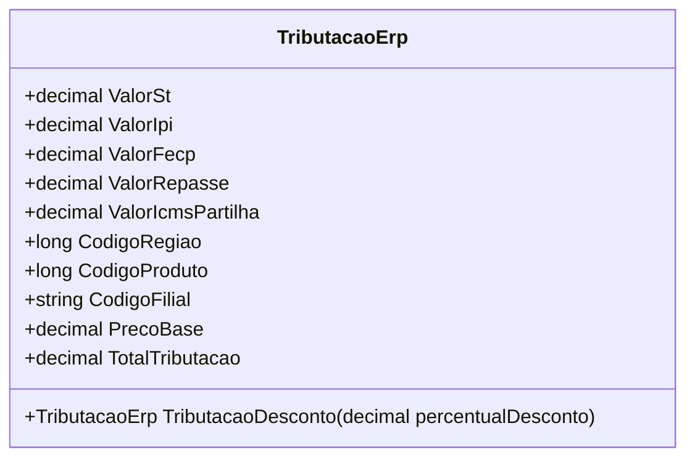

# TributacaoErp
**Namespace**: IsthmusWinthor.Dominio.POCO.Precos  
**Nome do Arquivo**: TributacaoErp.cs  

## Visão Geral e Responsabilidade
A classe `TributacaoErp` representa os cálculos de tributações associadas aos produtos no sistema ERP. Ela agrega e calcula diversos tipos de tributos, como ICMS, IPI e outros elementos relevantes à tributação, permitindo a aplicação de descontos e a correta apuração do total de tributos em cenários de venda, especialmente em contextos de promoção.

## Métodos de Negócio

### Título: `TributacaoDesconto` (public)
- **Objetivo**: Aplica um percentual de desconto sobre o preço base e sobre os valores dos tributos, recalculando a tributação total de forma proporcional ao desconto aplicado.
  
- **Comportamento**:
  1. Recebe como parâmetro um `percentualDesconto`.
  2. Cria uma nova instância de `TributacaoErp`.
  3. Recalcula cada valor de tributação (`ValorFecp`, `ValorIcmsPartilha`, `ValorIpi`, `ValorRepasse`, `ValorSt`), subtraindo a fração correspondente ao desconto.
  4. Ajusta o `PrecoBase` subtraindo o valor proporcional ao desconto.
  5. Retorna a nova instância com os valores ajustados.

- **Retorno**: Retorna uma nova instância do tipo `TributacaoErp`, com os valores tributários recalculados em função do percentual de desconto aplicado.

## Propriedades Calculadas e de Validação
- **TotalTributacao**: Propriedade calculada que retorna a soma total das tributações (`ValorSt + ValorIpi + ValorFecp + ValorRepasse + ValorIcmsPartilha`), facilitando a obtenção do total de tributos aplicados de forma direta.

## Navigations Property
- Não possui propriedades que são classes complexas do domínio.

## Tipos Auxiliares e Dependências
- Nenhum enumerador ou classe auxiliar é utilizado diretamente pela classe `TributacaoErp`.

## Diagrama de Relacionamentos

