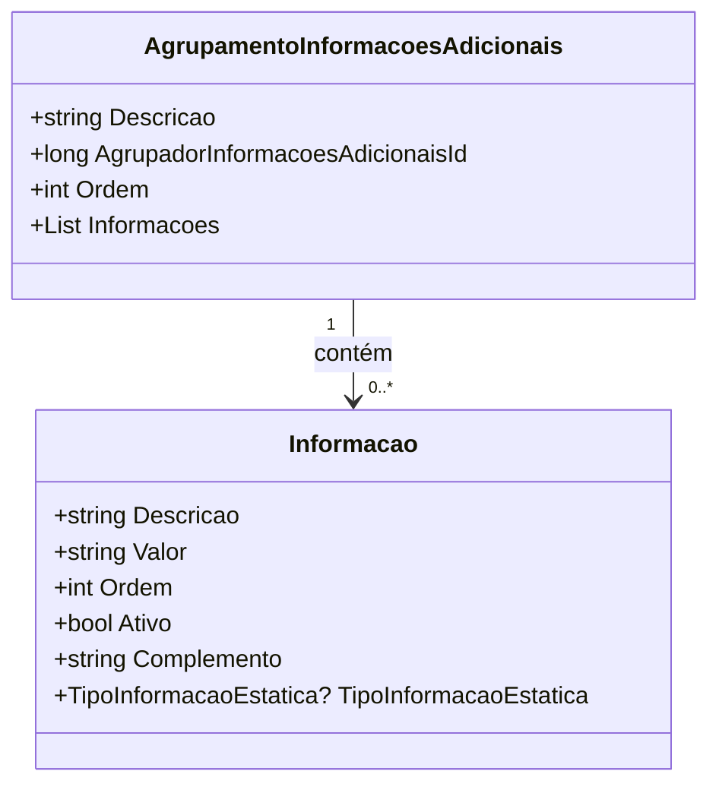

# AgrupamentoInformacoesAdicionais
**Namespace**: IsthmusWinthor.Dominio.POCO.Produtos  
**Nome do Arquivo**: AgrupamentoInformacoesAdicionais.cs  

## Visão Geral e Responsabilidade
A classe `AgrupamentoInformacoesAdicionais` representa um conjunto de informações adicionais que podem ser agrupadas sob um identificador comum, permitindo uma melhor organização e apresentação de dados relacionados dentro do sistema. Esta classe é fundamental para o estabelecimento de uma estrutura hierárquica que facilite o acesso e a manipulação de informações adicionais de produtos, garantindo que sejam exibidas de forma ordenada e coerente.

## Métodos de Negócio
*Nenhum método com lógica de negócio foi identificado nesta classe, apenas propriedades simples que transmitem dados.*

## Propriedades Calculadas e de Validação
*Nenhuma propriedade com lógica de validação ou cálculo foi identificada nesta classe, apenas propriedades anêmicas.*

## Navigations Property
- `Informacoes`: lista de instâncias da classe [Informacao](Informacao.md), que representa informações adicionais específicas.

---

# Informacao
**Namespace**: IsthmusWinthor.Dominio.POCO.Produtos  
**Nome do Arquivo**: Informacao.cs  

## Visão Geral e Responsabilidade
A classe `Informacao` encapsula elementos que compõem uma informação adicional, incluindo detalhes como descrição e valor. Esta estrutura é essencial para a configuração de dados adicionais, permitindo ao sistema atribuir e organizar informações relevantes de forma eficiente e acessível.

## Métodos de Negócio
*Nenhum método com lógica de negócio foi identificado nesta classe, apenas propriedades simples que transmitem dados.*

## Propriedades Calculadas e de Validação
- `Ativo`: Esta propriedade é um sinalizador que indica se a informação está ativa. Em um cenário onde uma informação deva ser exibida ou utilizada, este flag garante que apenas informações ativas sejam processadas e apresentadas ao usuário.

## Navigations Property
*Nenhuma Navigations Property foi identificada nesta classe.*

## Tipos Auxiliares e Dependências
- `TipoInformacaoEstatica`: Enum que define os tipos de informações que podem ser utilizados na classe [TipoInformacaoEstatica](TipoInformacaoEstatica.md).

---

## Diagrama de Relacionamentos

---
Gerada em 29/12/2025 22:00:04
