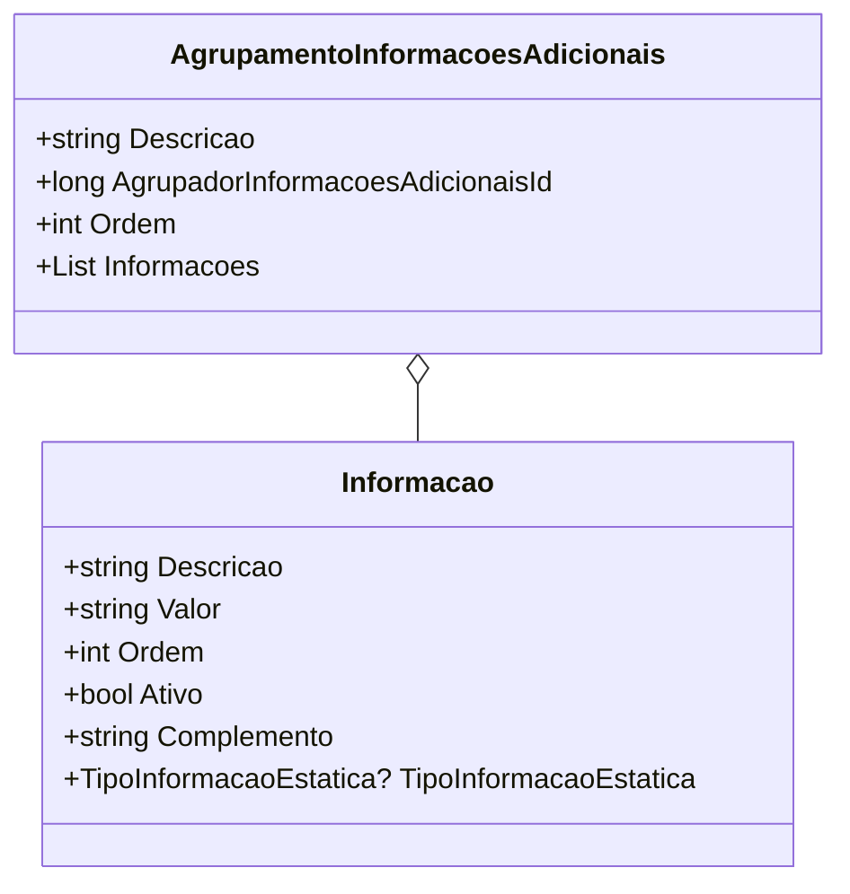
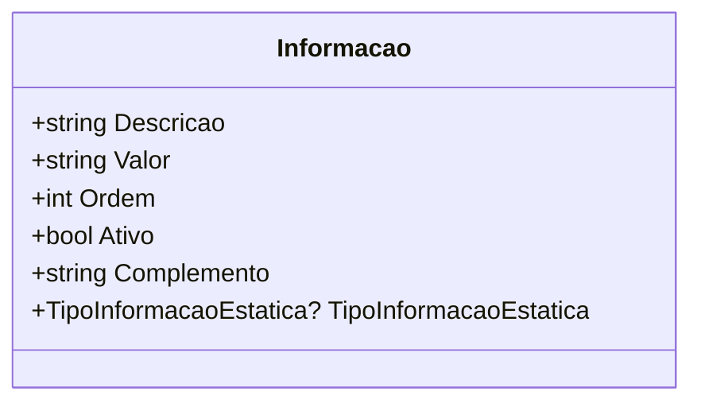

# AgrupamentoInformacoesAdicionais

**Namespace**: IsthmusWinthor.Dominio.POCO.Produtos  
**Nome do Arquivo**: AgrupamentoInformacoesAdicionais.cs  

## Visão Geral e Responsabilidade
A classe `AgrupamentoInformacoesAdicionais` atua como um modelo de domínio que agrupa informações adicionais relacionadas a um contexto ou entidade específica, permitindo que múltiplas informações sejam organizadas e manipuladas de maneira coesa. Isso resolve o problema de gerenciamento e exibição de dados complementares em um sistema que pode necessitar de categorização e hierarquização de informações.

## Propriedades Calculadas e de Validação
Não existem propriedades na classe `AgrupamentoInformacoesAdicionais` que realizem cálculos no `get` ou validações no `set` diretamente.

## Navigations Property
- `Informacoes`: Listagem de objetos do tipo `Informacao`.  
  - Link: [Informacao](Informacao.md)

## Tipos Auxiliares e Dependências
- `TipoInformacaoEstatica`: Enumerador utilizado como uma propriedade na classe `Informacao`.  
  - Link: [TipoInformacaoEstatica](TipoInformacaoEstatica.md)  

## Diagrama de Relacionamentos

---

# Informacao

**Namespace**: IsthmusWinthor.Dominio.POCO.Produtos  
**Nome do Arquivo**: Informacao.cs  

## Visão Geral e Responsabilidade
A classe `Informacao` representa um conjunto de dados que encapsula uma descrição, um valor e outras propriedades que delineiam a atividade e o tipo da informação. Sua responsabilidade é fornecer um modelo para dados que podem ser ativados, complementados e categorizados, assim contribuindo para a flexibilidade e integração de informações adicionais em um sistema.

## Propriedades Calculadas e de Validação
- `Ativo`: essa propriedade determina se a informação é considerada válida ou utilizável no contexto atual. Enquanto `get` simplesmente retorna o valor do estado de atividade, modificá-la pode ter implicações no uso da informação em interfaces ou lógicas de negócio.

## Types Auxiliares e Dependências
- `TipoInformacaoEstatica`: Enumerador utilizado para determinar a categorização da informação.  
  - Link: [TipoInformacaoEstatica](TipoInformacaoEstatica.md)

## Diagrama de Relacionamentos

